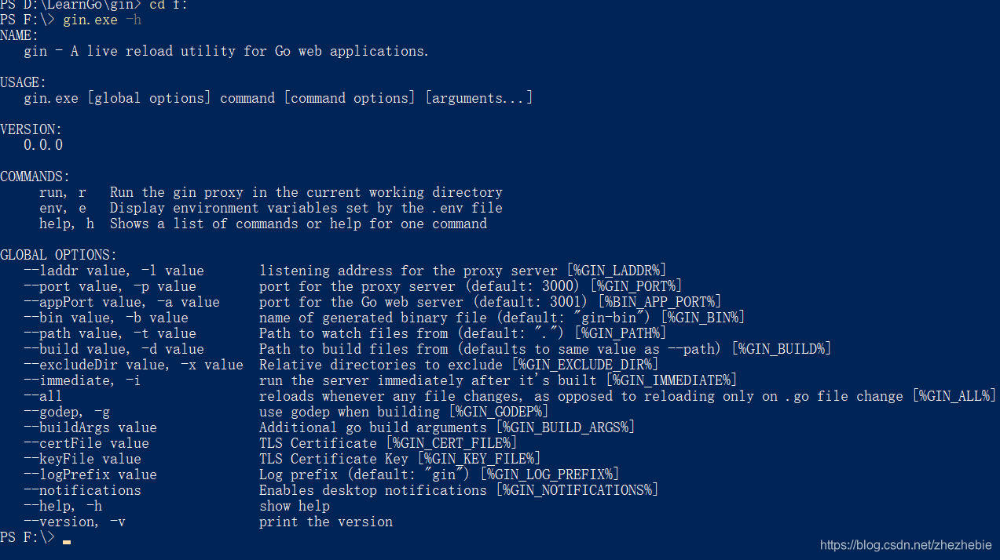
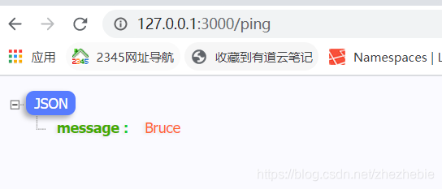

# Gin框架学习--搭建gin框架，并运行起来 #

## 安装go ##

我是windows开发环境。下载golang安装包：https://studygolang.com/dl/golang/go1.15.6.windows-amd64.msi
一般是会自动添加环境变量的，无需修改；

## 设置国内包源： ##

    go env -w GO111MODULE=on
    go env -w GOPROXY=https://goproxy.cn,direct  #这样的话下载包很快
    go env

## 安装gin框架 ##

框架地址：https://github.com/gin-gonic/gin
在你要新建项目的地方运行以下命令：

    go mod init myapp #这个myapp是项目名

执行完会提示：

    go: creating new go.mod: module myapp 

然后我们就可以安装你想要的包了：

    go get github.com/gin-gonic/gin@latest
    或者：go mod download github.com/gin-gonic/gin@latest

查看go mod帮助：

```
PS D:\LearnGo\gin> go help mod
Go mod provides access to operations on modules.

Note that support for modules is built into all the go commands,
not just 'go mod'. For example, day-to-day adding, removing, upgrading,
and downgrading of dependencies should be done using 'go get'.
See 'go help modules' for an overview of module functionality.

Usage:

        go mod <command> [arguments]

The commands are:

        download    download modules to local cache
        edit        edit go.mod from tools or scripts
        graph       print module requirement graph
        init        initialize new module in current directory
        tidy        add missing and remove unused modules
        vendor      make vendored copy of dependencies
        verify      verify dependencies have expected content
        why         explain why packages or modules are needed

Use "go help mod <command>" for more information about a command.

```

## 测试gin是否正常安装 ##

在任意位置打开命令行，运行以下命令：

    gin.exe  -h

如下图所示即正确安装：



## 第一个程序，跑起来 ##

在你项目新建一个文件main.go，内容如下：

```
package main

import "github.com/gin-gonic/gin"

func main() {
	r := gin.Default()
	r.GET("/ping", func(c *gin.Context) {
		c.JSON(200, gin.H{
			"message": "Bruce",
		})
	})
	r.Run()
}
```

    gin.exe run main.go  

访问浏览器：

注意：默认是808端口，我这个端口是我配置热重启之后程序更换的。不安装热重启的话每次都需要重新运行程序，比较麻烦，所以建议立马装上热重启，加快开发速度。

## 配置热重启： ##

需要下载一个包：

    go get github.com/codegangsta/gin
    gin.exe run main.go  



比较顺利，框架已经跑起来了。有时间再写个简单的curd。

————————————————

版权声明：本文为CSDN博主「SHUIPING_YANG」的原创文章，遵循CC 4.0 BY-SA版权协议，转载请附上原文出处链接及本声明。

原文链接：https://blog.csdn.net/zhezhebie/article/details/111999362