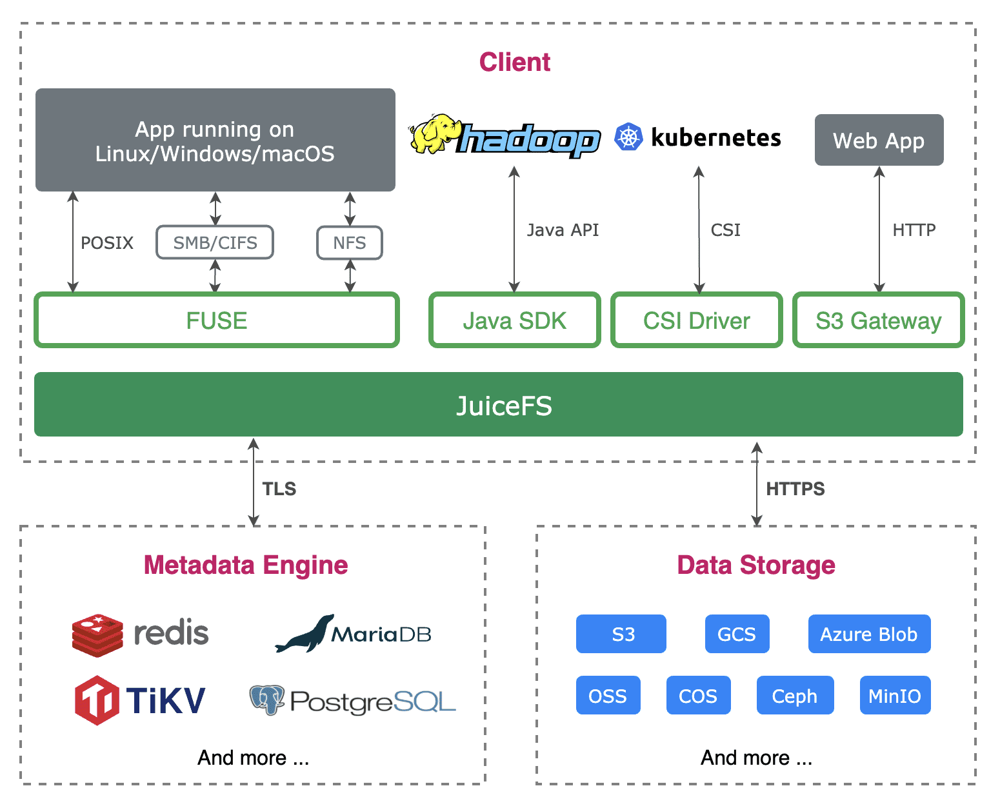

# GitHub开源项目推荐|高性能 POSIX 共享文件系统-juicefs

[软件开发与运维](https://www.toutiao.com/c/user/74391496436173/?source=weitoutiao_detail)

2023-04-02 10:48

关注

GitHub开源项目推荐|高性能 POSIX 共享文件系统-juicefs
juicefs是一个GitHub上优秀的开源项目，目前项目点赞数已达：7.8k，像使用本地存储一样高效使用海量云端存储，可同时被多台主机同时挂载读写。

项目开源协议：Apache-2.0
项目主开发语言：Go
项目地址：[网页链接](https://github.com/juicedata/juicefs)

JuiceFS是一个高性能的POSIX共享文件系统，它是一个开源项目，主要使用Go语言进行开发。JuiceFS的目标是提供一个高效、可靠、易于使用的文件系统，以满足现代应用程序的需求。
JuiceFS的主要特点是其高性能和可扩展性。它使用了一种分布式存储架构，可以将数据存储在多个节点上，从而提高了系统的可靠性和性能。JuiceFS还支持多种存储后端，包括本地磁盘、云存储和对象存储等，可以根据实际需求进行选择。
JuiceFS还提供了一些高级功能，例如数据压缩、数据加密和数据快照等。这些功能可以帮助用户更好地管理和保护数据。JuiceFS还支持POSIX标准，可以与现有的应用程序和工具无缝集成。
总之，JuiceFS是一个非常有用的工具，可以帮助用户构建高性能、可靠的文件系统，以满足现代应用程序的需求。它的开源性质也使得用户可以自由地使用、修改和分享代码，从而促进了技术的发展和创新。

