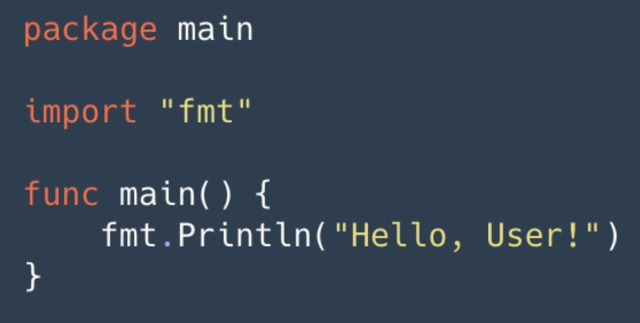
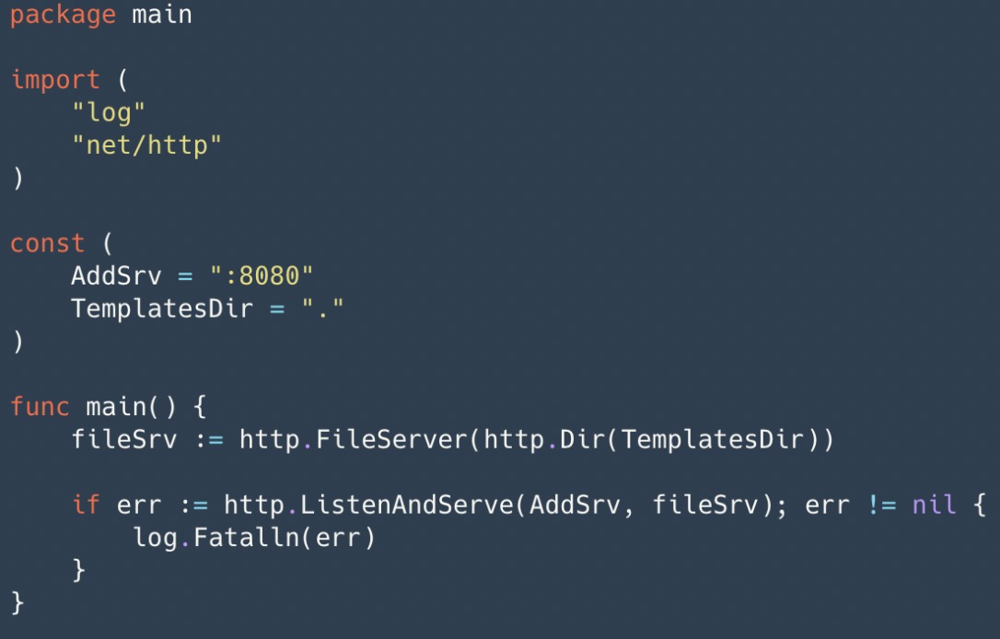
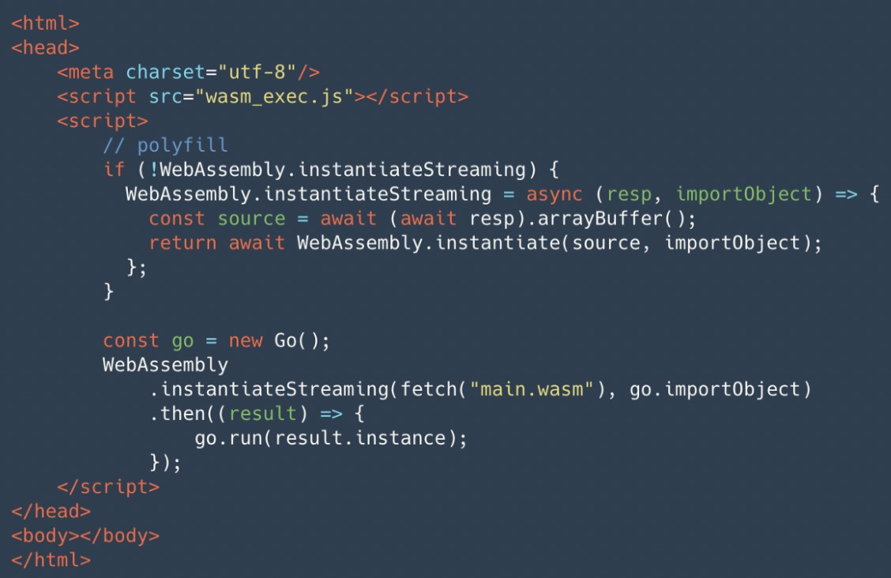
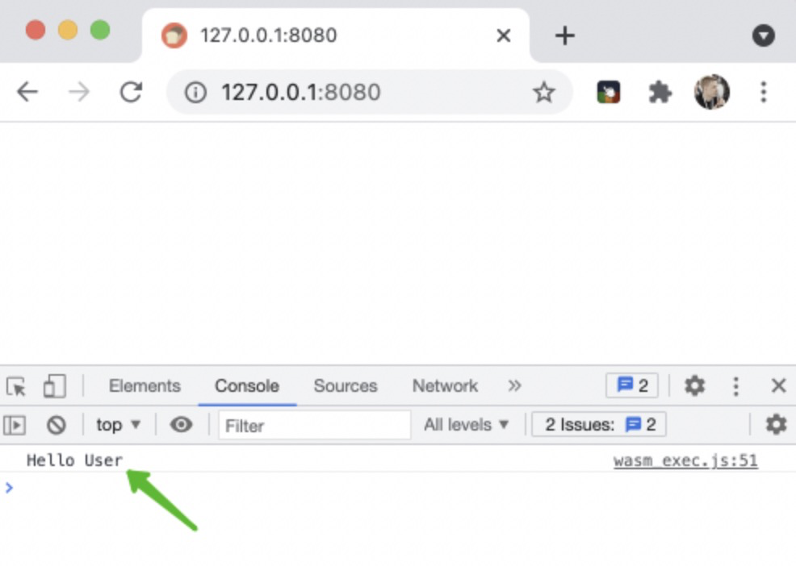

# Go WASM 从零开始 #

WASM已经从之前的概念慢慢变成一种技术实现，未来很可能被广泛应用到浏览器端，不仅解决了后端开发前端的问题，而且在执行效率上要比js 性能高出一截。

今天我们就通过一个简单hello world项目体验一下wasm 的魅力，首先我们创建一个hello 的Go文件。



编译代码，这里有两个小细节：GOOS指定 js , GOARCH 指定 wasm。这两个参数在交叉编译的时候非常常见。


然后我们将生成的 js 文件拷贝到当前目录


为了提供web 服务，我们还需要启动一个 file web server。就是一个简单的FileServer。几行代码搞定，主要是将我们的前端项目发布出去，如果你已经有其他的web 服务，譬如nginx 这步也可以省略。



当然，这个项目里面还需要一个html 页面，这个页面无非就是为了加载 go wasm。



总的代码路径如下，然后启动我们的服务：go run server.go。

```
└── example.com
    ├── app
    │   └── main.go
    ├── index.html
    ├── main.wasm
    ├── server.go
    └── wasm_exec.js
```

好了，接下来就是见证奇迹的时刻，访问我们的服务，在控制台就可以看到输出了。



原文链接：https://www.toutiao.com/a7056330666471883275/?channel=&source=search_tab
