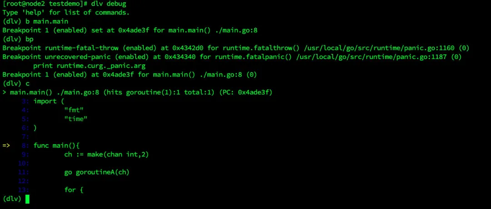
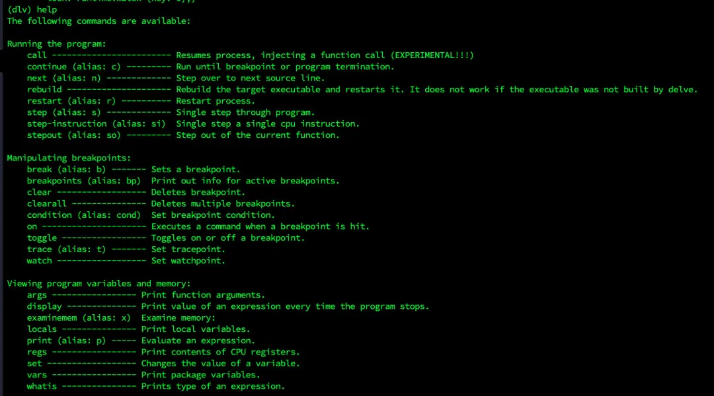
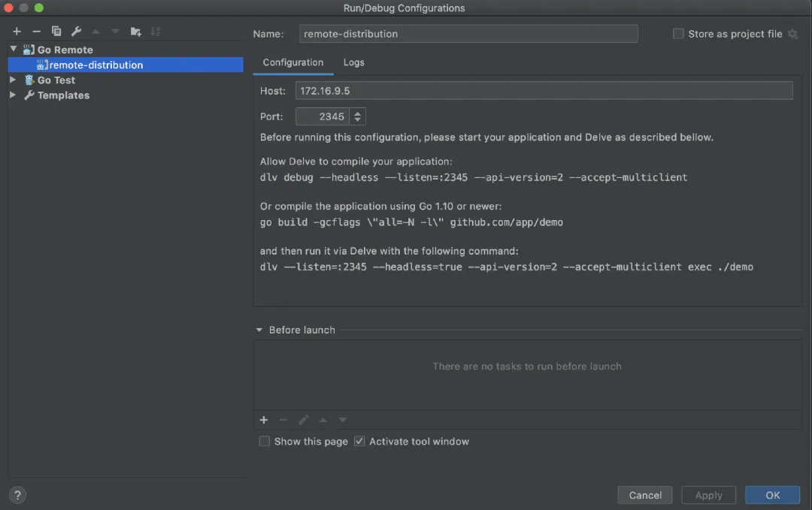

# Go 调试工具 dlv 安装及使用 #

Go开发大全 2021-12-01 12:10

【导读】go 开发测试中经常用什么工具调试代码？本文介绍了命令行工具 dlv 的用法。

## 安装 go ##

```
1234567891011121314wget https://studygolang.com/dl/golang/go1.14.1.linux-amd64.tar.gz

tar -C /usr/local -zxvf go1.14.1.linux-amd64.tar.gz

mkdir -p /home/go/bin/home/go/pkg /home/go/src  #官方建议工作目录为/home/go

vi .bash_profile
#在最下面添加
export GOROOT=/usr/local/go
export GOPATH=/home/go
export PATH=$PATH:$GOROOT/bin:$GOPATH/bin
export GOPROXY="https://goproxy.io"
source .bash_profile
```

## 安装 Delve ##

```
12345# cd $GOPATH/src/
# git clone https://github.com/derekparker/delve.git
# cd delve/cmd/dlv/
# go build
# go install
```

## 命令介绍 ##

Delve 时 Go 程序的源代码级的调试器。

Delve 通过控制进程的执行、评估变量以及提供线程/ goroutine 状态、CPU 寄存器状态等信息，使你能够与程序进行交互。

```
123456789101112131415161718192021222324252627282930313233343536373839404142434445 使用“--”将标志传递给正在调试的程序，例如：

`dlv exec ./hello -- server --config conf/config.toml`

Usage:
  dlv [command]

Available Commands:
  attach      连接到正在运行的进程并开始调试。
  connect     连接到无头调试服务器。
  core        检查核心转储。
  debug       编译并开始调试当前目录下的主包或指定的包。
  exec        执行预编译的二进制文件，并开始调试会话。
  help        帮助信息
  run         弃用的命令。使用“debug”替代它。
  test        编译测试二进制文件并开始调试程序。
  trace       编译并开始跟踪程序。
  version     打印版本。

Flags:
      --accept-multiclient   允许无头服务器接受多个客户机连接。注意，服务器 API 不是可重入的，客户端必须协调。
      --api-version int      无头时选择 API 版本。(default 1)
      --backend string       后端选择：
            default        在 macOS 上使用 lldb，其他地方都是本地的。
            native        本地后端。
            lldb        使用 lldb-server 或 debugserver.
            rr            使用 mozilla rr (https://github.com/mozilla/rr).
         (default "default") 默认使用的是 default
      --build-flags string   生成标志，以传递给编译器。
      --headless             仅在 headless 模式下运行调试服务器。
      --init string          初始化文件，由终端客户端执行。
  -l, --listen string        调试服务器监听地址。(default "localhost:0")
      --log                  启用调试服务器日志记录。
      --log-output string    应该产生调试输出的组件的逗号分隔列表，可能的值为：
            debugger    记录调试器命令
            gdbwire        日志连接到 gdbserial 后端
            lldbout        将输出从 debugserver/lldb 复制到标准输出
            debuglineerr    读取。debug_line 时日志可恢复错误
            rpc            记录所有 RPC 消息
            fncall        日志函数调用协议
            minidump    日志 minidump 加载
            使用--log 启用日志时，默认为“debugger”.
      --wd string            用于运行程序的工作目录。(default ".")

使用"dlv [command] --help"获取有关命令的详细信息。
debug 和 attach 使用的多一点
```

**dlv debug**

	dlv debug test.go -- arg1 arg2

- b(break) main.main：设置断点，还可以根据行号设置断点 b 9
- bp：查找已经设置的断点
- c：该命令是让程序运行起来，遇到设置的断点会停止


图片



截屏 2021-05-31 上午 11.23.03

- restart：重新开始下一轮的调试
- n：下一步，不会陷入内部
- s：进入某个函数的内部，源码函数也跟踪进去
- so：如果用 s 陷入到内部函数，可以快速使用该命令跳出来，回到进入点
- p [var_name]：打印变量的值
- gr and grs：这两个命令是用来查看 goroutine 的
- help：使用过程中随时通过 help 查看命令

图片


截屏 2021-05-31 上午 11.40.25

**dlv attach**

如果项目正在运行中，想要对正在运行的项目进行调试

1. 首先使用"ps aux | grep 编译文件名"来查看运行程序的进程号 pid
1. 然后就能够使用"dlv attach pid"来连接该运行程序，然后就能使用之前 debug 中的命令来进行调试了

**GoLand + Delve：远程调试**

前面的例子有使用 Delve 启动应用或 attach 到应用进行调试，但添加断点，运行到下一步，查看变量值等操作都是在终端中，输入 delve 命令来进行的。这种调试方式也太古老了，效率低下。真实场景下，几乎不会使用这种方式来进行调试。我们还是希望借助 IDE 进行更高效的调试。下面就介绍如何在 GoLand 中配合 delve 进行调试。包括附加到进程调试和远程调试。其实附加到本地进程和远程调试原理是一样的，待调试的进程是通过 delve 启动的，delve 会启动进程，并立即附加到进程，开启一个 debug session。并且启动一个 debug server，暴露某个端口，客户端 IDE 可以通过该端口连接到 debug server 进行调试。

**远程调试 Debug 优点**

1. 极大的加快开发速度，减少给在代码中使用大量 log 来定位错误（开发效率太低）
1. 最大程度的使用 linux 远程服务器环境，极大的简化本地部署模拟服务器环境
1. 可以绕过数据库内网的限制
1. 完美的解决一些不支持 windows 开发的依赖

**步骤**

在服务器上运行 delve server，可以是用 delve 运行 go 代码，也可以是运行可执行程序，也可以是侵入一个运行中的 go 程序，一般来说 attach 一个运行中的 go 程序比较常见

	1dlv attach $PID --headless --api-version=2 --log --listen=:1234

这样 delve server 就起来了，然后 继续下一步就是 Goland 连接调试

直接在 Goland 中配置 Host 和 Port 即可，然后在源代码中选择这个“Go Remote”调试器进行调试

图片


转自：

cnblogs.com/yrxing/p/14830827.html


 - EOF -

推荐阅读（点击标题可打开）

1、[Golang动手写一个Http Proxy](http://mp.weixin.qq.com/s?__biz=MzAwNjMxMTgwNw==&mid=2247489634&idx=1&sn=a210ca9e310f4fe08c42dd93a98d1401&chksm=9b0e0272ac798b64a7ff1d1c122f7b5593c29cd25e2bee822be7e06bc850caa85a1ff649f057&scene=21#wechat_redirect)

2、[Go mod 使用](http://mp.weixin.qq.com/s?__biz=MzAwNjMxMTgwNw==&mid=2247489673&idx=1&sn=ba036f233480c12b9d95ecacec689877&chksm=9b0e0299ac798b8f8e62f0d3b68ed62486d9d5a565a8084a38d2b6ec0199146addaadec21a52&scene=21#wechat_redirect)

3、[Golang 百万级并发 Server](http://mp.weixin.qq.com/s?__biz=MzAwNjMxMTgwNw==&mid=2247489614&idx=1&sn=153764baed8788e5671827145f9c165c&chksm=9b0e025eac798b48e288d4a59b98286a27ba27e65d3c4f154ea996cc622d416e5866c957cbec&scene=21#wechat_redirect)

