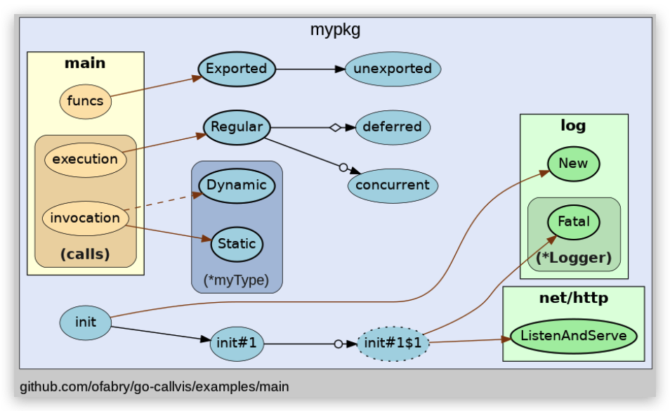

# Golang 可视化工具之go-callvis

 [kaliarch](https://bbs.huaweicloud.com/community/usersnew/id_1572321197421283) 发表于 2021/10/04 21:41:08

 

 1.3k+  0  0

【摘要】 一 背景日常我们会看一些开源项目，或者想看自己写的代码可视化，在golang中可以利用工具实现，go-callvis是以图片的形式展示了go程序的调用关系，在看复杂项目时尤其有用。 二 go-callvies 简介 2.1 工具简介Go-callvis 是一个开发工具，用于帮助使用交互式视图可视化 Go 程序的调用图。此工具的目的是为开发人员提供一个可视化的 Go 程序概览，使用来自调用图...

# 一 背景

日常我们会看一些开源项目，或者想看自己写的代码可视化，在golang中可以利用工具实现，go-callvis是以图片的形式展示了go程序的调用关系，在看复杂项目时尤其有用。

# 二 go-callvies 简介

## 2.1 工具简介

Go-callvis 是一个开发工具，用于帮助使用交互式视图可视化 Go 程序的调用图。

此工具的目的是为开发人员提供一个可视化的 Go 程序概览，使用来自调用图的数据及其与包和类型的关系。这在大型项目中特别有用，因为这些项目的代码复杂度要高得多，或者只是简单地试图理解其他人的代码。

## 2.2 特性

- 支持go mod
- 程序中的特定焦点包
- 点击软件包，使用交互式查看器快速切换焦点
- 按类型按包和/或方法分组函数
- 过滤器包到特定的导入路径前缀
- 忽略标准库中的函数
- 省略各种类型的函数调用

# 三 安装

- go get安装

```shell
$ go get -u github.com/ofabry/go-callvis 
```

- 源码编译安装

```shell
$ git clone https://github.com/ofabry/go-callvis.git cd go-callvis && make install
```

# 四 输出示例



它运行指针分析来构造程序的调用图，并使用数据生成点格式的输出，可以使用 Graphviz 工具进行渲染。

# 五 安装

```shell
go get -u github.com/ofabry/go-callvis
# or
git clone https://github.com/ofabry/go-callvis.git
cd go-callvis && make install
```

# 六 使用

go-callvis [可选参数] <包路径>

**1）使用浏览器交互展示**

默认情况下，HTTP服务器在http://localhost:7878/上侦听，请使用选项`-http="ADDR:PORT"`更改HTTP服务器地址。

**2）静态输出**

要生成单个输出文件，使用选项`-file=<file path>`选择输出文件目标。

输出格式默认为svg，使用选项`-format=<svg|png|jpg|…>`选择其他输出格式。

**3）其他参数**

```javascript
-debug
         输出详细日志
   -file string
         以文件新式输出结果，并将忽略server交互模式
   -focus string
         Focus specific package using name or import path. (default "main")
   -format string
         输出文件的格式 [svg | png | jpg | ...] (默认 "svg")
   -graphviz
         使用Graphviz渲染图像
   -group string
         分组功能，根据包 与/或 类型分组 [pkg, type] (用逗号分开) (默认 "pkg")，例如 -group pkg,type
   -http string
         HTTP 服务地址 (默认 ":7878")
   -ignore string
        忽略包含给定前缀的包路径(用逗号分开)
   -include string
         包含具有给定前缀的包路径 (用逗号分开)
   -limit string
         Limit package paths to given prefixes (separated by comma)
   -minlen uint
         Minimum edge length (for wider output). (default 2)
   -nodesep float
         Minimum space between two adjacent nodes in the same rank (for taller output). (default 0.35)
   -nointer
         忽略对未导出函数的调用。
   -nostd
         忽略标准库的调用
   -skipbrowser
         跳过打开浏览器
   -tags build tags
         a list of build tags to consider satisfied during the build. For more information about build tags, see the description of build constraints in the documentation for the go/build package
   -tests
         包含测试代码
   -version
         显示版本号
1）解析main包
go-callvis -skipbrowser -nostd ./
2）解析testPkg包
go-callvis -group pkg,type -focus testPkg github.com/项目具体路径 
```

# 简单示例

```shell
$ go-callvis -format png -group pkg,type -focus github.com/kaliarch/linux_agent
/cmd/app github.com/kaliarch/linux_agent
2021/08/18 11:22:12 http serving at http://localhost:7878
2021/08/18 11:22:21 converting dot to png..
2021/08/18 11:22:22 serving file: /var/folders/wn/367g1v9n1bv0sg1k8qldzym80000gn/T/go-callvis_export.png
```


# 参考链接

- *[GitHub - ofabry/go-callvis: Visualize call graph of a Go program using Graphviz](https://github.com/TrueFurby/go-callvis)*

【版权声明】本文为华为云社区用户原创内容，转载时必须标注文章的来源（华为云社区），文章链接，文章作者等基本信息，否则作者和本社区有权追究责任。如果您发现本社区中有涉嫌抄袭的内容，欢迎发送邮件至：[cloudbbs@huaweicloud.com](mailto:cloudbbs@huaweicloud.com)进行举报，并提供相关证据，一经查实，本社区将立刻删除涉嫌侵权内容。
