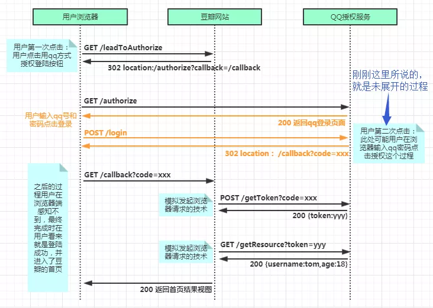
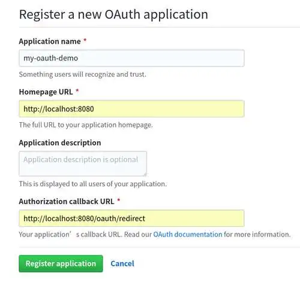
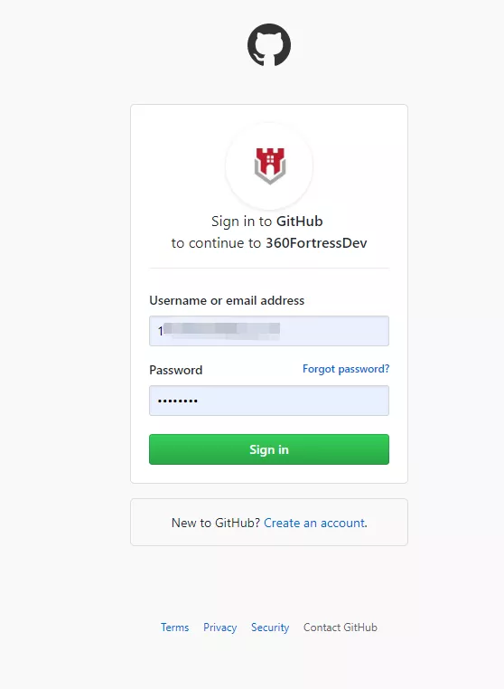

# Golang前后端分离项目OAuth2教程 #

【导读】本文介绍了 OAuth 和 go 语言实现。

## 什么是OAuth2 ##

OAuth2.0是OAuth协议的下一版本,但不向后兼容OAuth 1.0即完全废止了OAuth1.0. OAuth 2.0关注客户端开发者的简易性. 要么通过组织在资源拥有者和HTTP服务商之间的被批准的交互动作代表用户,要么允许第三方应用代表用户获得访问的权限. 同时为Web应用,桌面应用和手机,和起居室设备提供专门的认证流程.2012年10月,OAuth 2.0协议正式发布为RFC 6749. 在认证和授权的过程中涉及的三方包括：

- 服务提供方,用户使用服务提供方来存储受保护的资源,如照片,视频,联系人列表.
- 用户,存放在服务提供方的受保护的资源的拥有者.
- 客户端,要访问服务提供方资源的第三方应用,通常是网站,如提供照片打印服务的网站.在认证过程之前,客户端要向服务提供者申请客户端标识.

使用OAuth进行认证和授权的过程如下所示:

- （A）用户打开客户端以后,客户端要求用户给予授权.
- （B）用户同意给予客户端授权.
- （C）客户端使用上一步获得的授权,向认证服务器申请令牌.
- （D）认证服务器对客户端进行认证以后,确认无误,同意发放令牌.
- （E）客户端使用令牌,向资源服务器申请获取资源.
- （F）资源服务器确认令牌无误,同意向客户端开放资源



## GitHub OAuth2 第三方登录示例教程 ##

**1. 应用注册**

一个应用要求 OAuth 授权,必须先到对方网站登记,让对方知道是谁在请求.

所以,您要先去 GitHub 登记一下.当然,我已经登记过了,您使用我的登记信息也可以,但为了完整走一遍流程,还是建议大家自己登记.这是免费的. OAuth应用注册地址 https://github.com/settings/applications/new, 或者登陆自己的GitHub账号, settings -> Developer Settings -> OAuth Apps -> New OAuth App

填写自己的callback地址



**2. 获取ClientId, ClientSecret 和 callback地址**

这里我使用viper 为golang管理配置文件, 因为是前后端分离项目所以比传统的网站复杂一点点.

配置文件 config.toml

```
[github]
    client_id="xxxID"
    client_secret="xxxxxx"
    callback_url="http://localhost:8080/#/" # vuejs 页面来处理callback
```

加载配置文件代码,详细 Go进阶:怎么使用viper管理配置

```
func initViperConfigFile(configFile string) {
    viper.SetConfigName(configFile)        // name of config file (without extension)
    viper.AddConfigPath("/etc/fortress/")  // path to look for the config file in
    viper.AddConfigPath("$HOME/.fortress") // call multiple times to add many search paths
    viper.AddConfigPath(".")               // optionally look for config in the working directory
    err := viper.ReadInConfig()            // Find and read the config file
    if err != nil {                        // Handle errors reading the config file
        log.Fatal("application configuration'initialization is failed", err)
    }
}
```

**3. 前端(Vuejs SPA)处理登陆按钮跳转到Github授权页面**

前端页面登陆按钮跳转 html<el-button type="warning" @click.native.prevent="handleLoginGithub" v-text="Github第三方账号登陆"> </el-button> 后端提供接口传送配置文件中的github.client_id 和github.client_url地址给前端, 前端按钮点击 跳转到github授权页面

```
//跳转到GitHub授权页面
handleLoginGithub() {
    const url = `https://github.com/login/oauth/authorize?client_id=${this.github_client_id}&scope=user:email&allow_signup=true`;
    window.location.href = url
},
```

client_id是必须参数 callback 参数空浏览器则跳转到您GitHub OAuth APP配置的页面(这个页面将会带上一个code参数) 更详细参数见github.com OAuth 文档

**4. 授权码code**

登录后,GitHub 询问用户,该应用正在请求数据,您是否同意授权.



用户同意授权, GitHub 就会跳转到redirect_uri指定的跳转网址,并且带上授权码,跳转回来的 URL 就是下面的样子. http://localhost:8080/?code=4f307b926cc11ae4883b#/login. 其中code用来换取github.com token

**5. 前端Vuejs(SPA)项目得到code参数发送给golang后端服务**

注意: 我的vuejs SPA 使用的vue-router Hash 模式 github.com 配置的callback是前端登陆页面, mounted方法检测 是否带有参数code 如果query 参数部位空把 code通过fetchGithubUserLoginByCodeOrDoNothing 发送给后端

```
    export default {
        data() {
            return {
                github_client_id: "",
            };
        },
        computed: {
            //计算属性获取,url中query code 参数
            code() {
                const urlParams = new URLSearchParams(window.location.search);
                const myParam = urlParams.get('code');
                return myParam || false;
            },
        },
        mounted() {
            //获取配置cong golang 后端
            this.$http.get('meta').then(res => {
                if (res) {
                    this.github_client_id = res.data.github_client_id;
                    this.github_callback_url = res.data.github_callback_url;
                    //使用github Oauth登陆
                    this.fetchGithubUserLoginByCodeOrDoNothing()
                }
            });
        },
        methods: {
            //code 发送给后端
            fetchGithubUserLoginByCodeOrDoNothing() {
                //使用github Oauth登陆
                if (this.code) {
                    let data = {code: this.code};
                    this.$http.get('login-github', {params: data}).then(res => {
                        if (res) {
                            localStorage.setItem("token", res.data.token);
                            localStorage.setItem("expire_ts", res.data.expire_ts);
                            localStorage.setItem("expire", res.data.expire);
                            this.$store.commit('setUser', res.data);
                            this.$router.push({name: "machine"});
                        }
                    })
                }
            },
            //跳转到GitHub 授权页面
            handleLoginGithub() {
                const url = `https://github.com/login/oauth/authorize?client_id=${this.github_client_id}&scope=user:email&allow_signup=true`;
                window.location.href = url
            },
        }
    }
```

**6. Golang后端收到github.com OAuth code**

1. 通过code 调用 POST https://github.com/login/oauth/access_token 获取token参数
2. 
golang Gin 路由配置: r.GET("api/login-github", handler.LoginGithub)

```
//LoginGithub github OAuth 登陆
func LoginGithub(c *gin.Context) {
    //获取github.com OAuth APP给的token
    code := c.Query("code")
    //code 通过 github.com OAuth API 换取 token
    // token 根据GitHub 开发API接口获取用户信息 githubUser
    gu, err := fetchGithubUser(code)
    if err != nil {
        jsonError(c, err)
        return
    }
....
....
....
```

2. 令牌通过token 调通 GET https://api.github.com/user 获取授权的用户信息
3. 
代码中,GitHub 的令牌接口https://github.com/login/oauth/access_token需要提供三个参数.

- $client_id$：客户端的 ID
- client_secret：客户端的密钥
- code：授权码 作为回应,GitHub 会返回一段 JSON 数据,里面包含了令牌accessToken.

```
type githubToken struct {
    AccessToken string `json:"access_token"`
    Scope       string `json:"scope"`
    TokenType   string `json:"token_type"`
}

//fetchGithubUser 获取github 用户信息
func fetchGithubUser(code string) (*githubUser, error) {
    client := http.Client{}
    params := fmt.Sprintf(`{"client_id":"%s","client_secret":"%s","code":"%s"}`, viper.GetString("github.client_id"), viper.GetString("github.client_secret"), code)
    req, err := http.NewRequest("POST", "https://github.com/login/oauth/access_token", bytes.NewBufferString(params))
    if err != nil {
        return nil, err
    }
    req.Header.Add("Accept", "application/json")
    req.Header.Add("Content-type", "application/json")
    res, err := client.Do(req)
    if err != nil {
        return nil, err
    }

    defer res.Body.Close()
    bs, err := ioutil.ReadAll(res.Body)
    if err != nil {
        return nil, err
    }

    gt := githubToken{}
    err = json.Unmarshal(bs, >)
    if err != nil {
        return nil, err
    }
    //得到token struct
....
....
....
....        
```

3. API 数据通过数据库是否曾在用户, 如果存在生成对应用户在自己APP中的JWT token,如果没有则创建用户,生成自己应用的jwt token

GitHub API 的地址是https://api.github.com/user,请求的时候必须在 HTTP 头信息里面带上令牌Authorization: Bearer 361507da. 然后,就可以拿到用户数据,得到用户的身份.

```
//fetchGithubUser 获取github 用户信息
func fetchGithubUser(code string) (*githubUser, error) {
    client := http.Client{}
...
...
...
    //开始获取用户信息
    req, err = http.NewRequest("GET", "https://api.github.com/user", nil)
    req.Header.Add("Authorization", "Bearer "+gt.AccessToken)

    res, err = client.Do(req)
    if err != nil {
        return nil, err
    }
    if res.StatusCode != 200 {
        return nil, errors.New("using github token to fetch User Info failed with not 200 error")
    }
    defer res.Body.Close()
    bs, err = ioutil.ReadAll(res.Body)
    if err != nil {
        return nil, err
    }
    gu := &githubUser{}
    err = json.Unmarshal(bs, gu)
    if err != nil {
        return nil, err
    }
    if gu.Email == nil {
        tEmail := fmt.Sprintf("%d@github.com", gu.ID)
        gu.Email = &tEmail
    }
    gu.Token = gt.AccessToken
    return gu, nil
}

type githubUser struct {
    Login             string    `json:"login"`
    ID                int       `json:"id"`
    NodeID            string    `json:"node_id"`
    AvatarURL         string    `json:"avatar_url"`
    GravatarID        string    `json:"gravatar_id"`
    URL               string    `json:"url"`
    HTMLURL           string    `json:"html_url"`
    FollowersURL      string    `json:"followers_url"`
    FollowingURL      string    `json:"following_url"`
    GistsURL          string    `json:"gists_url"`
    StarredURL        string    `json:"starred_url"`
    SubscriptionsURL  string    `json:"subscriptions_url"`
    OrganizationsURL  string    `json:"organizations_url"`
    ReposURL          string    `json:"repos_url"`
    EventsURL         string    `json:"events_url"`
    ReceivedEventsURL string    `json:"received_events_url"`
    Type              string    `json:"type"`
    SiteAdmin         bool      `json:"site_admin"`
    Name              string    `json:"name"`
    Blog              string    `json:"blog"`
    Location          string    `json:"location"`
    Email             *string   `json:"email"`
    Hireable          bool      `json:"hireable"`
    Bio               string    `json:"bio"`
    PublicRepos       int       `json:"public_repos"`
    PublicGists       int       `json:"public_gists"`
    Followers         int       `json:"followers"`
    Following         int       `json:"following"`
    CreatedAt         time.Time `json:"created_at"`
    UpdatedAt         time.Time `json:"updated_at"`
    Token             string    `json:"-"`
}
```

h_login_github.go 完整代码是这样的

```
package handler

import (
    "bytes"
    "encoding/json"
    "errors"
    "fmt"
    "fortress/model"
    "github.com/gin-gonic/gin"
    "github.com/spf13/viper"
    "io/ioutil"
    "net/http"
    "time"
)


//LoginGithub github OAuth 登陆
func LoginGithub(c *gin.Context) {

    //获取github.com OAuth APP给的token
    code := c.Query("code")
    //code 通过 github.com OAuth API 换取 token
    // token 根据GitHub 开发API接口获取用户信息 githubUser
    gu, err := fetchGithubUser(code)
    if err != nil {
        jsonError(c, err)
        return
    }

    user := model.User{}
    //比对或者插入GitHub User 到数据库
    //同时参数自己的jwt token
    data, err := user.LoginGithub(*gu.Email, gu.Login, gu.Name, gu.Bio, gu.AvatarURL, gu.Token)
    if handleError(c, err) {
        return
    }
    jsonData(c, data)
}

//fetchGithubUser 获取github 用户信息
func fetchGithubUser(code string) (*githubUser, error) {
    client := http.Client{}
    params := fmt.Sprintf(`{"client_id":"%s","client_secret":"%s","code":"%s"}`, viper.GetString("github.client_id"), viper.GetString("github.client_secret"), code)
    req, err := http.NewRequest("POST", "https://github.com/login/oauth/access_token", bytes.NewBufferString(params))
    if err != nil {
        return nil, err
    }
    req.Header.Add("Accept", "application/json")
    req.Header.Add("Content-type", "application/json")
    res, err := client.Do(req)
    if err != nil {
        return nil, err
    }

    defer res.Body.Close()
    bs, err := ioutil.ReadAll(res.Body)
    if err != nil {
        return nil, err
    }

    gt := githubToken{}
    err = json.Unmarshal(bs, >)
    if err != nil {
        return nil, err
    }

    //开始获取用户信息
    req, err = http.NewRequest("GET", "https://api.github.com/user", nil)
    req.Header.Add("Authorization", "Bearer "+gt.AccessToken)

    res, err = client.Do(req)
    if err != nil {
        return nil, err
    }
    if res.StatusCode != 200 {
        return nil, errors.New("using github token to fetch User Info failed with not 200 error")
    }
    defer res.Body.Close()
    bs, err = ioutil.ReadAll(res.Body)
    if err != nil {
        return nil, err
    }
    gu := &githubUser{}
    err = json.Unmarshal(bs, gu)
    if err != nil {
        return nil, err
    }
    if gu.Email == nil {
        tEmail := fmt.Sprintf("%d@github.com", gu.ID)
        gu.Email = &tEmail
    }
    gu.Token = gt.AccessToken
    return gu, nil
}

type githubToken struct {
    AccessToken string `json:"access_token"`
    Scope       string `json:"scope"`
    TokenType   string `json:"token_type"`
}
type githubUser struct {
    Login             string    `json:"login"`
    ID                int       `json:"id"`
    NodeID            string    `json:"node_id"`
    AvatarURL         string    `json:"avatar_url"`
    GravatarID        string    `json:"gravatar_id"`
    URL               string    `json:"url"`
    HTMLURL           string    `json:"html_url"`
    FollowersURL      string    `json:"followers_url"`
    FollowingURL      string    `json:"following_url"`
    GistsURL          string    `json:"gists_url"`
    StarredURL        string    `json:"starred_url"`
    SubscriptionsURL  string    `json:"subscriptions_url"`
    OrganizationsURL  string    `json:"organizations_url"`
    ReposURL          string    `json:"repos_url"`
    EventsURL         string    `json:"events_url"`
    ReceivedEventsURL string    `json:"received_events_url"`
    Type              string    `json:"type"`
    SiteAdmin         bool      `json:"site_admin"`
    Name              string    `json:"name"`
    Blog              string    `json:"blog"`
    Location          string    `json:"location"`
    Email             *string   `json:"email"`
    Hireable          bool      `json:"hireable"`
    Bio               string    `json:"bio"`
    PublicRepos       int       `json:"public_repos"`
    PublicGists       int       `json:"public_gists"`
    Followers         int       `json:"followers"`
    Following         int       `json:"following"`
    CreatedAt         time.Time `json:"created_at"`
    UpdatedAt         time.Time `json:"updated_at"`
    Token             string    `json:"-"`
}v
```

> 转自：
> 
> mojotv.cn/2019/08/05/golang-oauth2-login