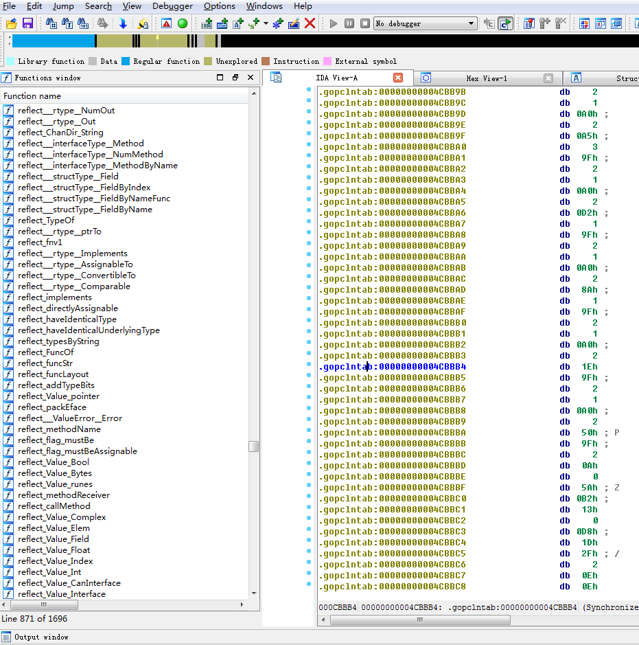

# golang语言编译的二进制可执行文件为什么比 C 语言大 #

最近一位朋友问我“为什么同样的hello world 入门程序”为什么golang编译出来的二进制文件，比 C 大，而且大很多。我做了个测试，来分析这个问题。C 语言的hello world程序：

```
#include <stdio.h>
int main() {
    printf("hello world!\n");
    return 0;
}
```

golang 语言的hello world程序：

```
package main
 
import "fmt"
 
func main() {
    fmt.Printf("hello, world!\n")
}
```

编译，查看生成文件大小

```
root@cnxct:/home/cfc4n/go_vs_c# gcc -o c.out main.c
root@cnxct:/home/cfc4n/go_vs_c# go build -o go_fmt.out main_fmt.go
root@cnxct:/home/cfc4n/go_vs_c# ll
total 1552
drwxr-xr-x 2 root  root     4096 Sep 20 16:56 ./
drwxr-xr-x 8 cfc4n cfc4n    4096 Sep 20 16:54 ../
-rwxr-xr-x 1 root  root     8600 Sep 20 16:56 c.out*
-rwxr-xr-x 1 root  root  1560062 Sep 20 16:56 go_fmt.out*
-rw-r--r-- 1 root  root       78 Sep 20 16:54 main.c
-rw-r--r-- 1 root  root       78 Sep 20 16:55 main_fmt.go
root@cnxct:/home/cfc4n/go_vs_c# du -sh *
12K c.out
1.5M    go_fmt.out
4.0K    main.c
4.0K    main_fmt.go
```

正如这位朋友所说c.out是12K，而 go_fmt.out是1.5M，差距奇大无比….为什么呢？

这两个二进制可执行文件文件里，都包含了什么？

众所周知，linux 上的二进制可执行文件是 ELF Executable and Linkable Format 可执行和可链接格式


ELF文件格式组成

如上图，ELF 文件分为如下：

- ELF文件的组成：ELF header
- 程序头：描述段信息
- Section头：链接与重定位需要的数据
- 程序头与Section头需要的数据.text .data

在 Linux 上， 查看elf格式构成可以使用readelf

ELF Header:头的信息

```
root@cnxct:/home/cfc4n/go_vs_c# readelf -h c.out
ELF Header:
  Magic:   7f 45 4c 46 02 01 01 00 00 00 00 00 00 00 00 00
  Class:                             ELF64
  Data:                              2's complement, little endian
  Version:                           1 (current)
  OS/ABI:                            UNIX - System V
  ABI Version:                       0
  Type:                              EXEC (Executable file)
  Machine:                           Advanced Micro Devices X86-64
  Version:                           0x1
  Entry point address:               0x400430
  Start of program headers:          64 (bytes into file)
  Start of section headers:          6616 (bytes into file)
  Flags:                             0x0
  Size of this header:               64 (bytes)
  Size of program headers:           56 (bytes)
  Number of program headers:         9
  Size of section headers:           64 (bytes)
  Number of section headers:         31
  Section header string table index: 28
 
 root@cnxct:/home/cfc4n/go_vs_c# readelf -h go_fmt.out
ELF Header:
  Magic:   7f 45 4c 46 02 01 01 00 00 00 00 00 00 00 00 00
  Class:                             ELF64
  Data:                              2's complement, little endian
  Version:                           1 (current)
  OS/ABI:                            UNIX - System V
  ABI Version:                       0
  Type:                              EXEC (Executable file)
  Machine:                           Advanced Micro Devices X86-64
  Version:                           0x1
  Entry point address:               0x44e360
  Start of program headers:          64 (bytes into file)
  Start of section headers:          456 (bytes into file)
  Flags:                             0x0
  Size of this header:               64 (bytes)
  Size of program headers:           56 (bytes)
  Number of program headers:         7
  Size of section headers:           64 (bytes)
  Number of section headers:         23
  Section header string table index: 3
```

ELF 头的长度都是一样的，不会带来总体体积的变化。区别是个别字节的值不一样，比如Entry point address 程序入口点的值不一样等。

接下来是 程序头：，也就是 section部分（在linker连接器的角度是section部分或者装载器角度的segment）

```
root@cnxct:/home/cfc4n/go_vs_c# readelf -d c.out
 
Dynamic section at offset 0xe28 contains 24 entries:
  Tag        Type                         Name/Value
 0x0000000000000001 (NEEDED)             Shared library: [libc.so.6]
 0x000000000000000c (INIT)               0x4003c8
 0x000000000000000d (FINI)               0x4005b4
 0x0000000000000019 (INIT_ARRAY)         0x600e10
 0x000000000000001b (INIT_ARRAYSZ)       8 (bytes)
 0x000000000000001a (FINI_ARRAY)         0x600e18
 0x000000000000001c (FINI_ARRAYSZ)       8 (bytes)
 0x000000006ffffef5 (GNU_HASH)           0x400298
 0x0000000000000005 (STRTAB)             0x400318
 0x0000000000000006 (SYMTAB)             0x4002b8
 0x000000000000000a (STRSZ)              61 (bytes)
 0x000000000000000b (SYMENT)             24 (bytes)
 0x0000000000000015 (DEBUG)              0x0
 0x0000000000000003 (PLTGOT)             0x601000
 0x0000000000000002 (PLTRELSZ)           48 (bytes)
 0x0000000000000014 (PLTREL)             RELA
 0x0000000000000017 (JMPREL)             0x400398
 0x0000000000000007 (RELA)               0x400380
 0x0000000000000008 (RELASZ)             24 (bytes)
 0x0000000000000009 (RELAENT)            24 (bytes)
 0x000000006ffffffe (VERNEED)            0x400360
 0x000000006fffffff (VERNEEDNUM)         1
 0x000000006ffffff0 (VERSYM)             0x400356
 0x0000000000000000 (NULL)               0x0
```

可以看到c.out里引用了一个动态链接库libc.so.6，再看下go_fmt.out的情况

```
  root@cnxct:/home/cfc4n/go_vs_c# readelf -d go_fmt.out
 
There is no dynamic section in this file.
```

c.out的执行，依赖了libc.so.6, libc.so.6肯定需要ld.so的，看下依赖情况，

```
root@cnxct:/home/cfc4n/go_vs_c# ldd c.out
    linux-vdso.so.1 =>  (0x00007fff3a195000)
    libc.so.6 => /lib/x86_64-linux-gnu/libc.so.6 (0x00007f4ac4d06000)
    /lib64/ld-linux-x86-64.so.2 (0x0000558ece3fe000)
 
root@cnxct:/home/cfc4n/go_vs_c# ldd go_fmt.out
    not a dynamic executable
```


依赖了libc.so这个动态链接库

也就是说，C的程序默认使用了libc.so动态链接库，go 的程序，默认进行了静态编译，不依赖任何动态链接库。所以体积变大了。 那么，只是这一个原因吗？

我在 golang 的官方文档里找到如下的解释：

> Why is my trivial program such a large binary?
The linker in the gc tool chain creates statically-linked binaries by default. All Go binaries therefore include the Go run-time, along with the run-time type information necessary to support dynamic type checks, reflection, and even panic-time stack traces.

> A simple C “hello, world” program compiled and linked statically using gcc on Linux is around 750 kB, including an implementation of printf. An equivalent Go program using fmt.Printf is around 1.5 MB, but that includes more powerful run-time support and type information.

将c的程序也使用静态编译试试。。。

```
gcc -static -o c_static.out main.c
root@cnxct:/home/cfc4n/go_vs_c# du -sh *
12K c.out
888K    c_static.out
1.5M    go_fmt.out
4.0K    main.c
4.0K    main_fmt.go
```

可以看到，使用静态编译生成的二进制文件c_static.out为888K，仍然比 GO 写的小了一半，这到底是为什么呢？到底是哪里多了？

在ELF 可执行文件里，就需要以程序编译链接的角度来分析了，对于一个 ELF 文件的分析，上面部分分析过 ELF header部分，以及 dynamic section的情况了。再以看一下剩余的section信息。


链接器视图与加载器视图

ELF中的section主要提供给Linker使用， 而segment提供给Loader用，Linker需要关心.text, .rel.text, .data, .rodata等等，关键是Linker需要做relocation。而Loader只需要知道这个段的Read、Write、Execute的属性。

再去看go_fmt.out里都包含了什么，为了方便校对，写了一个程序来对比

```
package main
 
import (
    "debug/elf"
    "fmt"
    "os"
)
 
func main() {
    if len(os.Args) != 3 {
        fmt.Println("参数不对")
        os.Exit(0)
    }
 
    strFile1 := os.Args[1]
    strFile2 := os.Args[2]
    f1, e := elf.Open(strFile1)
    if e != nil {
        panic(e)
    }
 
    f2, e := elf.Open(strFile2)
    if e != nil {
        panic(e)
    }
    mapSection1 := make(map[string]string, 0)
    mapSection2 := make(map[string]string, 0)
 
    //[Nr]    Name    Type    Address    Offset    Size    EntSize    Flags    Link    Info    Align
    var size1 uint64
    var size2 uint64
    for _, s := range f1.Sections {
        mapSection1[s.Name] = fmt.Sprintf("%s\t%s\t%s\t%010x\t%010x\t%d\t%x\t%s\t%x\t%x\t%x\t", s.Name, strFile1, s.Type.String(), s.Addr, s.Offset, s.Size, s.Entsize, s.Flags.String(), s.Link, s.Info, s.Addralign)
        size1 += s.Size
    }
 
    for _, s := range f2.Sections {
        mapSection2[s.Name] = fmt.Sprintf("%s\t%s\t%s\t%010x\t%010x\t%d\t%x\t%s\t%x\t%x\t%x\t", s.Name, strFile2, s.Type.String(), s.Addr, s.Offset, s.Size, s.Entsize, s.Flags.String(), s.Link, s.Info, s.Addralign)
        size2 += s.Size
    }
 
    fmt.Println(fmt.Sprintf("%s:%d\t%s:%d", strFile1, size1, strFile2, size2))
 
    fmt.Println("Name\tFile\tType\tAddress\tOffset\tSize\tEntSize\tFlags\tLink\tInfo\tAlign")
    for k, v := range mapSection1 {
        fmt.Println(v)
        if v1, found := mapSection2[k]; found {
            fmt.Println(v1)
            delete(mapSection2, k)
        }
    }
 
    for _, v := range mapSection2 {
        fmt.Println(v)
    }
}
```

对比一下两个文件的section段信息

```
root@cnxct:/home/cfc4n/go_vs_c# ./diffelf c_static.out go_fmt.out
c_static.out:910462 go_fmt.out:1674012
Name    File    Type    Address Offset  Size    EntSize Flags   Link    Info    Align
.init_array c_static.out    SHT_INIT_ARRAY  00006c8ed8  00000c8ed8  16  0   SHF_WRITE+SHF_ALLOC 00  8
.fini_array c_static.out    SHT_FINI_ARRAY  00006c8ee8  00000c8ee8  16  0   SHF_WRITE+SHF_ALLOC 00  8
.data   c_static.out    SHT_PROGBITS    00006c9080  00000c9080  6864    0   SHF_WRITE+SHF_ALLOC 0   020
.data   go_fmt.out  SHT_PROGBITS    00004fa4e0  00000fa4e0  7440    0   SHF_WRITE+SHF_ALLOC 0   020
.strtab c_static.out    SHT_STRTAB  0000000000  00000d6b40  26703   0   0x0 0   0   1
.strtab go_fmt.out  SHT_STRTAB  0000000000  00001704e0  51486   0   0x0 0   0   1
__libc_subfreeres   c_static.out    SHT_PROGBITS    00004bd6a8  00000bd6a8  80  0   SHF_ALLOC   00  8
__libc_thread_subfreeres    c_static.out    SHT_PROGBITS    00004bd708  00000bd708  8   0   SHF_ALLOC   0   0   8
.got    c_static.out    SHT_PROGBITS    00006c8fe8  00000c8fe8  16  8   SHF_WRITE+SHF_ALLOC 0   08
.comment    c_static.out    SHT_PROGBITS    0000000000  00000cab50  52  1   SHF_MERGE+SHF_STRINGS   00  1
.fini   c_static.out    SHT_PROGBITS    00004a0470  00000a0470  9   0   SHF_ALLOC+SHF_EXECINSTR 0   04
.eh_frame   c_static.out    SHT_PROGBITS    00004bd710  00000bd710  44948   0   SHF_ALLOC   0   08
.bss    c_static.out    SHT_NOBITS  00006cab60  00000cab50  6264    0   SHF_WRITE+SHF_ALLOC 0   020
.bss    go_fmt.out  SHT_NOBITS  00004fc200  00000fc200  108808  0   SHF_WRITE+SHF_ALLOC 0   020
.gcc_except_table   c_static.out    SHT_PROGBITS    00004c86a4  00000c86a4  179 0   SHF_ALLOC   00  1
.tdata  c_static.out    SHT_PROGBITS    00006c8eb8  00000c8eb8  32  0   SHF_WRITE+SHF_ALLOC+SHF_TLS 00  8
.note.gnu.build-id  c_static.out    SHT_NOTE    00004001b0  00000001b0  36  0   SHF_ALLOC   00  4
__libc_freeres_fn   c_static.out    SHT_PROGBITS    000049de60  000009de60  9513    0   SHF_ALLOC+SHF_EXECINSTR 0   0   10
.plt    c_static.out    SHT_PROGBITS    00004002f0  00000002f0  160 0   SHF_ALLOC+SHF_EXECINSTR 0   010
.note.stapsdt   c_static.out    SHT_NOTE    0000000000  00000cab84  3864    0   0x0 0   0   4
.symtab c_static.out    SHT_SYMTAB  0000000000  00000cbaa0  45216   18  0x0 20  2c7 8
.symtab go_fmt.out  SHT_SYMTAB  0000000000  0000164000  50400   18  0x0 16  5f  8
.note.ABI-tag   c_static.out    SHT_NOTE    0000400190  0000000190  32  0   SHF_ALLOC   0   04
.rela.plt   c_static.out    SHT_RELA    00004001d8  00000001d8  240 18  SHF_ALLOC+SHF_INFO_LINK018  8
.rodata c_static.out    SHT_PROGBITS    00004a0480  00000a0480  119332  0   SHF_ALLOC   0   0   20
.rodata go_fmt.out  SHT_PROGBITS    000047e000  000007e000  212344  0   SHF_ALLOC   0   0   20
.data.rel.ro    c_static.out    SHT_PROGBITS    00006c8f00  00000c8f00  228 0   SHF_WRITE+SHF_ALLOC 00  20
.init   c_static.out    SHT_PROGBITS    00004002c8  00000002c8  26  0   SHF_ALLOC+SHF_EXECINSTR 0   04
.text   c_static.out    SHT_PROGBITS    0000400390  0000000390  645828  0   SHF_ALLOC+SHF_EXECINSTR 0   010
.text   go_fmt.out  SHT_PROGBITS    0000401000  0000001000  508779  0   SHF_ALLOC+SHF_EXECINSTR 0   010
__libc_atexit   c_static.out    SHT_PROGBITS    00004bd6f8  00000bd6f8  8   0   SHF_ALLOC   0   08
.stapsdt.base   c_static.out    SHT_PROGBITS    00004bd700  00000bd700  1   0   SHF_ALLOC   0   01
.jcr    c_static.out    SHT_PROGBITS    00006c8ef8  00000c8ef8  8   0   SHF_WRITE+SHF_ALLOC 0   08
    c_static.out    SHT_NULL    0000000000  0000000000  0   0   0x0 0   0   0
    go_fmt.out  SHT_NULL    0000000000  0000000000  0   0   0x0 0   0   0
__libc_thread_freeres_fn    c_static.out    SHT_PROGBITS    00004a0390  00000a0390  222 0   SHF_ALLOC+SHF_EXECINSTR 0   0   10
__libc_freeres_ptrs c_static.out    SHT_NOBITS  00006cc3d8  00000cab50  48  0   SHF_WRITE+SHF_ALLOC 0   0   8
.shstrtab   c_static.out    SHT_STRTAB  0000000000  00000dd38f  361 0   0x0 0   0   1
.shstrtab   go_fmt.out  SHT_STRTAB  0000000000  00000b1d80  257 0   0x0 0   0   1
.tbss   c_static.out    SHT_NOBITS  00006c8ed8  00000c8ed8  48  0   SHF_WRITE+SHF_ALLOC+SHF_TLS 00  8
.got.plt    c_static.out    SHT_PROGBITS    00006c9000  00000c9000  104 8   SHF_WRITE+SHF_ALLOC 00  8
.itablink   go_fmt.out  SHT_PROGBITS    00004b29d8  00000b29d8  56  0   SHF_ALLOC   0   08
.gopclntab  go_fmt.out  SHT_PROGBITS    00004b2a20  00000b2a20  282414  0   SHF_ALLOC   0   020
.debug_abbrev   go_fmt.out  SHT_PROGBITS    000051c000  00000fd000  255 0   0x0 0   0   1
.debug_frame    go_fmt.out  SHT_PROGBITS    000052b2d5  000010c2d5  69564   0   0x0 0   0   1
.debug_aranges  go_fmt.out  SHT_PROGBITS    000054634c  000012734c  48  0   0x0 0   0   1
.debug_info go_fmt.out  SHT_PROGBITS    00005463a6  00001273a6  248638  0   0x0 0   0   1
.note.go.buildid    go_fmt.out  SHT_NOTE    0000400fc8  0000000fc8  56  0   SHF_ALLOC   00  4
.debug_pubtypes go_fmt.out  SHT_PROGBITS    000053e9e5  000011f9e5  31079   0   0x0 0   0   1
.debug_gdb_scripts  go_fmt.out  SHT_PROGBITS    000054637c  000012737c  42  0   0x0 0   01
.debug_line go_fmt.out  SHT_PROGBITS    000051c0ff  00000fd0ff  61910   0   0x0 0   0   1
.typelink   go_fmt.out  SHT_PROGBITS    00004b1ea0  00000b1ea0  2872    0   SHF_ALLOC   0   020
.noptrdata  go_fmt.out  SHT_PROGBITS    00004f8000  00000f8000  9416    0   SHF_WRITE+SHF_ALLOC 00  20
.gosymtab   go_fmt.out  SHT_PROGBITS    00004b2a10  00000b2a10  0   0   SHF_ALLOC   0   01
.noptrbss   go_fmt.out  SHT_NOBITS  0000516b20  0000116b20  18080   0   SHF_WRITE+SHF_ALLOC 00  20
.debug_pubnames go_fmt.out  SHT_PROGBITS    000053c291  000011d291  10068   0   0x0 0   0   1
```

发现go_fmt.out多了好多.debug_*开头的 section，这是用于 debug 的段信息。再次编译，去除这些信息，同时也把 C 静态编译的二进制也去除符号表和重定位信息。

```
root@cnxct:/home/cfc4n/go_vs_c# gcc -static -o c_static_gs.out -g -s main.c
root@cnxct:/home/cfc4n/go_vs_c# go build -o go_fmt_sw.out -ldflags="-s -w" main_fmt.go
 
root@cnxct:/home/cfc4n/go_vs_c# du -sh *
12K c.out
820K    c_static_gs.out
888K    c_static.out
1.5M    go_fmt.out
1012K   go_fmt_sw.out
```

如上结果，go_fmt_sw.out为1012K，c_static_gs.out为820K，还大了近200KB。到底是哪里大的呢？

刚刚的两个elf 文件的section对比中，还有一个比较特殊的go_fmt.out中 有一个名字叫.gopclntab的段，类型是SHT_PROGBITS程序段,大小为 282414字节，也就是275K，在c_static.out里并没有这个段的，也没有.gosymtab这个段。二者不一样，section段名字有规范标准吗？
其实，对于linker链接器来说，会关心段(section)的名字，但对loader加载器来说，并不关心名字，只关心这个段(segment)的权限，是否可执行，所在的偏移地址，用于函数的执行。

那.gopclntab段包含了什么内容呢？我写了一个程序分析了这个段的内容，程序代码如下：

```
package main
 
import (
    "debug/elf"
    "debug/gosym"
    "fmt"
    "os"
)
 
func main() {
    if len(os.Args) != 2 {
        fmt.Println("参数不对")
        os.Exit(0)
    }
 
    strFile1 := os.Args[1]
 
    f1, err := elf.Open(strFile1)
    if err != nil {
        panic(err)
    }
 
    symtab, err := f1.Section(".gosymtab").Data()
    if err != nil {
        f1.Close()
        panic(".gosymtab 异常")
    }
 
    gopclntab, err := f1.Section(".gopclntab").Data()
    if err != nil {
        f1.Close()
        panic(".gopclntab 异常")
    }
 
    pcln := gosym.NewLineTable(gopclntab, f1.Section(".text").Addr)
    var tab *gosym.Table
    tab, err = gosym.NewTable(symtab, pcln)
    if err != nil {
        f1.Close()
        panic(err)
    }
    for _, x := range tab.Funcs {
        fmt.Println(fmt.Sprintf("addr:0x%x\t\tname:%s,\t",x.Entry,x.Name))
    }
}
```

编译后执行

```
root@cnxct:/home/cfc4n/go_vs_c# ./expelf go_fmt.out
addr:0x401000       name:sync/atomic.StoreUint32,   
addr:0x401010       name:sync/atomic.StoreUint64,   
addr:0x401020       name:sync/atomic.StoreUintptr,  
addr:0x401030       name:runtime.memhash0,  
addr:0x401040       name:runtime.memhash8,  
......
addr:0x427040       name:runtime.printnl,   
......
addr:0x44dc80       name:runtime.memmove,   
addr:0x44e360       name:_rt0_amd64_linux,  
addr:0x44e380       name:main,  
addr:0x44e390       name:runtime.exit,  
addr:0x44ea70       name:runtime.epollwait, 
addr:0x44ea90       name:runtime.(*cpuProfile).(runtime.flushlog)-fm,   
addr:0x44eae0       name:type..hash.runtime.uncommontype,   
......
addr:0x452d60       name:math.init.1,   
addr:0x452e00       name:math.init, 
addr:0x452e70       name:math.hasSSE4,  
addr:0x452e90       name:type..hash.[70]float64,    
addr:0x452f10       name:type..eq.[70]float64,  
addr:0x452f50       name:errors.New,    
addr:0x452ff0       name:errors.(*errorString).Error,   
......
addr:0x4534c0       name:unicode/utf8.RuneCountInString,    
addr:0x453600       name:strconv.(*decimal).String, 
addr:0x453a00       name:strconv.digitZero, 
addr:0x453a30       name:strconv.trim,  
addr:0x453aa0       name:strconv.(*decimal).Assign, 
......
addr:0x4599c0       name:strconv.init,  
addr:0x459ad0       name:type..hash.strconv.decimal,    
addr:0x459ec0       name:type..eq.[61]strconv.leftCheat,    
addr:0x459f80       name:sync.(*Mutex).Lock,    
......
addr:0x45c6d0       name:syscall.Syscall6,  
addr:0x45c740       name:type..hash.[133]string,    
addr:0x45c7c0       name:type..eq.[133]string,  
addr:0x45c880       name:time.init, 
addr:0x45df30       name:type..hash.os.PathError,   
addr:0x45dfc0       name:type..eq.os.PathError, 
addr:0x45e0e0       name:reflect.makeMethodValue,   
addr:0x45eaf0       name:reflect.resolveReflectName,    
addr:0x45eb40       name:reflect.(*rtype).nameOff,  
......
addr:0x4710d0       name:reflect.(*funcTypeFixed64).Comparable, 
addr:0x4710f0       name:type..hash.reflect.funcTypeFixed128,   
addr:0x471170       name:type..eq.reflect.funcTypeFixed128, 
addr:0x471230       name:reflect.(*funcTypeFixed128).uncommon,  
......  
addr:0x471c50       name:reflect.(*sliceType).Comparable,   
addr:0x471c70       name:type..hash.struct { reflect.b bool; reflect.x interface {} },  
addr:0x471cf0       name:type..eq.struct { reflect.b bool; reflect.x interface {} },    
addr:0x471d70       name:type..hash.[27]string, 
addr:0x471df0       name:type..eq.[27]string,   
addr:0x471ea0       name:fmt.(*fmt).writePadding,   
addr:0x472020       name:fmt.(*fmt).pad,    
......
addr:0x47b730       name:fmt.(*pp).badArgNum,   
addr:0x47b940       name:fmt.(*pp).missingArg,  
addr:0x47bb50       name:fmt.(*pp).doPrintf,    
addr:0x47cf70       name:fmt.glob..func1,   
addr:0x47cfd0       name:fmt.init,  
addr:0x47d170       name:type..hash.fmt.fmt,    
addr:0x47d1f0       name:type..eq.fmt.fmt,  
addr:0x47d2a0       name:main.main, 
addr:0x47d310       name:main.init, 
```

如上可以看到，有很多函数是以fmt.(*pp)、strconv.*、sync.*、reflect.*、unicode.*等开头的，后面对应的函数名，也与 golang 的包里对应的包中函数名一致。。。用 IDA来确认一遍



，果然在 .gopclntab 段里有很多 reflect.*开头的函数。
这就很奇怪了，golang 编译时，默认把 runtime 包编译进来就好了，应该不会把strconv\sync\reflect\unicode等包包含进来啊。程序中，只写了一句fmt.Println()，莫非是fmt包import了其他几个包导致的？回去搜了下代码，果然…


嗯，应该是这里问题，改用 go 的内置函数print试试。

```
package main
 
func main() {
   print("hello, world!\n")
}
```

编译后，对比大小

```
root@cnxct:/home/cfc4n/go_vs_c# go build -o go_print.out main_print.go
root@cnxct:/home/cfc4n/go_vs_c# go build -o go_print_sw.out -ldflags="-s -w" main_print.go
root@cnxct:/home/cfc4n/go_vs_c# du -sh *
12K c.out
820K    c_static_gs.out
888K    c_static.out
1.5M    go_fmt.out
1012K   go_fmt_sw.out
940K    go_print.out
624K    go_print_sw.out
4.0K    main.c
4.0K    main_fmt.go
4.0K    main_print.go
```

看如上结果，go_print_sw.out 变成了 624K ， c_static_gs.out为820K，不光没比C的静态编译的大，还比它小呢。。。 不过呢，这也不能说明什么问题，只是因为其包含的函数内容不一样。

好了，至此已经知道为什么 golang 编译的文件比 C 的大了，因为 go 语言是静态编译的，而 C 的编译（比如 gcc编译器）都是动态链接库形式编译的。所以，导致了 go 编译的文件稍微大的问题。其次，跟其他语言比较字符串输出的话，用print内置函数就好了，就不要使用fmt包下的函数来比较了，因为 fmt 包引入了好多其他的包。。。这也增加编译后的二进制文件的体积。

其实呢，golang 的编译（不涉及 cgo 编译的前提下）默认使用了静态编译，不依赖任何动态链接库，这样可以任意部署到各种运行环境，不用担心依赖库的版本问题。只是体积大一点而已，存储时占用了一点磁盘，运行时，多占用了一点内存。早期动态链接库的产生，是因为早期的系统的内存资源十分宝贵，由于内存紧张的问题在早期的系统中显得更加突出，因此人们首先想到的是要解决内存使用效率不高这一问题，于是便提出了动态装入的思想。也就产生了动态链接库。在现在的计算机里，操作系统的硬盘内存更大了，尤其是服务器，32G、64G 的内存都是最基本的。可以不用为了节省几百 KB 或者1M，几 M 的内存而大大费周折了。而 golang 就采用这种做法，可以避免各种 so 动态链接库依赖的问题，这点是非常值得称赞的。

另外,.gopclntab 跟 .gosymtab段的讨论，以及其他建议

- https://groups.google.com/forum/#!topic/golang-dev/EJhwBrITcpA
- https://groups.google.com/forum/#!msg/golang-dev/EJhwBrITcpA/EMHeWpriGZUJ
- 如果想要ELF二进制程序变小的方法，还可以使用 linux 的strip，以及 UPX 来压缩 ELF 文件。
- 推荐一本书《[程序员的自我修养-链接、装载与库](https://book.douban.com/subject/3652388/)》链接

程序员的自我修养

参考：

- 《[程序的链接和装入及Linux下动态链接的实现](https://www.ibm.com/developerworks/cn/linux/l-dynlink/index.html)》
- 《[Reversing GO binaries like a pro](https://rednaga.io/2016/09/21/reversing_go_binaries_like_a_pro/)》

知识共享许可协议CFC4N的博客 由 CFC4N 创作，采用 知识共享 署名-非商业性使用-相同方式共享（3.0未本地化版本）许可协议进行许可。基于https://www.cnxct.com上的作品创作。

转载请注明转自：golang语言编译的二进制可执行文件为什么比 C 语言大

原为链接：http://www.cnxct.com/why-golang-elf-binary-file-is-large-than-c/