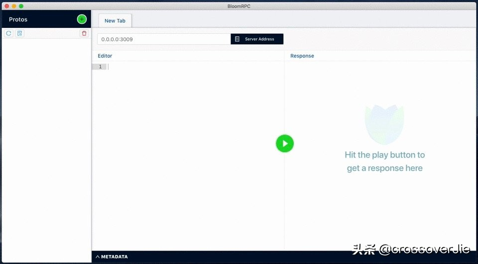
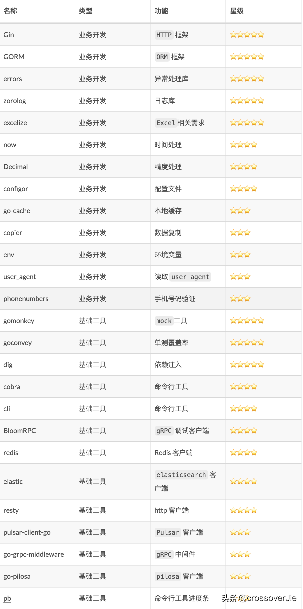
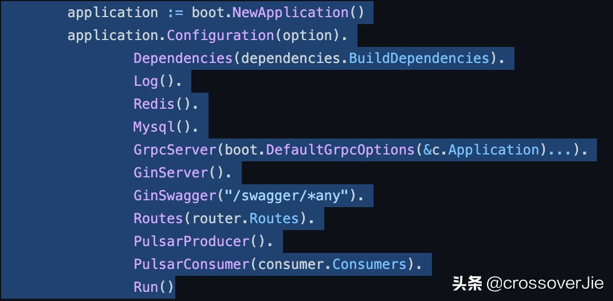
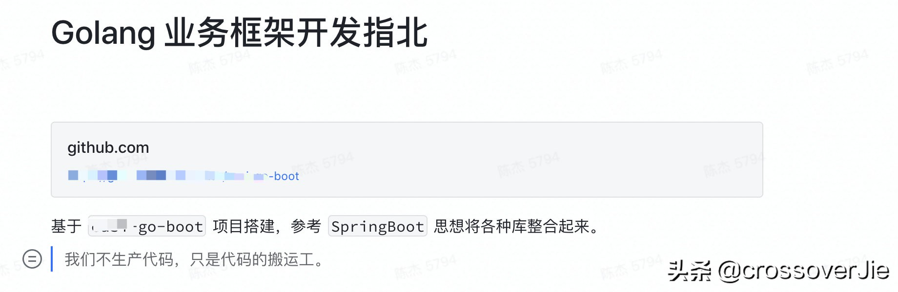

# 效率提高80%，Go开发必备的库与工具 #

不知不觉写 Go 已经快一年了，上线了大大小小好几个项目；心态也经历了几轮变化。

因为我个人大概前五年时间写的是 Java ，中途写过一年多的 Python，所以刚接触到 Go 时的感觉如下图：

效率提高80%，Go开发必备的库与工具
既没有 Java 的生态，也没有 Python 这么多语法糖。


这里就不讨论这几门语言谁强谁弱了；重点和大家分享下我们日常开发中所使用到的一些第三方库与工具。

这里我主要将这些库分为两类：

- 业务开发
- 基础工具开发

## 业务开发 ##

首先是业务开发，主要包含了 web、数据库、Redis 等。

**Gin**

首先是 Gin，一款 HTTP 框架，使用简单、性能优秀、资料众多；你还在犹豫选择哪款框架时，那就选择它吧，基本没错。

当然和它配套的 github.com/swaggo/gin-swagger swagger 工具也是刚需；利用它可以生成 swagger 文档。

**GORM**

GORM 也没啥好说的，如果你喜欢 orm 的方式操作数据库，那就选它吧；同样的也是使用简单、资料较多。

如果有读写分离需求，也可以使用 GORM 官方提供的插件 https://github.com/go-gorm/dbresolver ，配合 GORM 使用也是非常简单。

**errors**

Go 语言自身提供的错误处理比较简单，https://github.com/pkg/errors 提供了更强大的功能，比如：

- 包装异常
- 包装堆栈等。

常用的有以下 API：

```
// WithMessagef annotates err with the format specifier.
func WithMessagef(err error, format string, args ...interface{}) error

// WithStack annotates err with a stack trace at the point WithStack was called.
func WithStack(err error) error
```

**zerolog**

Go 里的日志打印库非常多，日志在日常开发中最好就是存在感低；也就是说性能强（不能影响到业务代码）、使用 API 简单。

```
"github.com/rs/zerolog/log"
log.Debug().Msgf("OrderID :%s", "12121")
```

**excelize**

https://github.com/qax-os/excelize是一个读写 Excel 的库，基本上你能遇到的 Excel 操作它都能实现。

**now 4 Star**

https://github.com/jinzhu/now 是一个时间工具库：

- 获取当前的年月日、时分秒。
- 不同时区支持。
- 最后一周、最后一个月等。

```
import "github.com/jinzhu/now"

time.Now() // 2013-11-18 17:51:49.123456789 Mon

now.BeginningOfMinute()        // 2013-11-18 17:51:00 Mon
now.BeginningOfHour()          // 2013-11-18 17:00:00 Mon
now.BeginningOfDay()           // 2013-11-18 00:00:00 Mon
now.BeginningOfWeek()          // 2013-11-17 00:00:00 Sun
now.BeginningOfMonth()         // 2013-11-01 00:00:00 Fri
now.BeginningOfQuarter()       // 2013-10-01 00:00:00 Tue
now.BeginningOfYear()          // 2013-01-01 00:00:00 Tue

now.EndOfMinute()              // 2013-11-18 17:51:59.999999999 Mon
now.EndOfHour()                // 2013-11-18 17:59:59.999999999 Mon
now.EndOfDay()                 // 2013-11-18 23:59:59.999999999 Mon
now.EndOfWeek()                // 2013-11-23 23:59:59.999999999 Sat
now.EndOfMonth()               // 2013-11-30 23:59:59.999999999 Sat
now.EndOfQuarter()             // 2013-12-31 23:59:59.999999999 Tue
now.EndOfYear()                // 2013-12-31 23:59:59.999999999 Tue

now.WeekStartDay = time.Monday // Set Monday as first day, default is Sunday
now.EndOfWeek()                // 2013-11-24 23:59:59.999999999 Sun
```

**Decimal**

当业务上需要精度计算时 https://github.com/shopspring/decimal 可以帮忙。

```
import (
 "fmt"
 "github.com/shopspring/decimal"
)

func main() {
 price, err := decimal.NewFromString("136.02")

 quantity := decimal.NewFromInt(3)
 fee, _ := decimal.NewFromString(".035")
 taxRate, _ := decimal.NewFromString(".08875")

 subtotal := price.Mul(quantity)

 preTax := subtotal.Mul(fee.Add(decimal.NewFromFloat(1)))

 total := preTax.Mul(taxRate.Add(decimal.NewFromFloat(1)))

 fmt.Println("Subtotal:", subtotal)                      // Subtotal: 408.06
 fmt.Println("Pre-tax:", preTax)                         // Pre-tax: 422.3421
 fmt.Println("Taxes:", total.Sub(preTax))                // Taxes: 37.482861375
 fmt.Println("Total:", total)                            // Total: 459.824961375
 fmt.Println("Tax rate:", total.Sub(preTax).Div(preTax)) // Tax rate: 0.08875
}
```

基本上你能想到的精度转换它都能做到；配合上 GORM 也可以将 model 字段声明为 decimal 的类型，数据库对应的也是 decimal ，这样使用起来时会更方便。

```
Amount decimal.Decimal `gorm:"column:amout;default:0.0000;NOT NULL" json:"amout"` 
```

**configor**

https://github.com/jinzhu/configor 是一个配置文件读取库，支持 YAML/JSON/TOML 等格式。

**go-cache**

https://github.com/patrickmn/go-cache 是一个类似于 Java 中的 Guava cache，线程安全，使用简单；不需要分布式缓存的简单场景可以考虑。

```
 c := cache.New(5*time.Minute, 10*time.Minute)
 // Set the value of the key "foo" to "bar", with the default expiration time
 c.Set("foo", "bar", cache.DefaultExpiration)
```

**copier**

https://github.com/jinzhu/copier 看名字就知道这是一个数据复制的库，与 Java 中的 BeanUtils.copy() 类似；可以将两个字段相同但对象不同的 struct 进行数据复制，也支持深拷贝。

```
func Copy(toValue interface{}, fromValue interface{}) (err error) 
```

在我们需要一个临时 struct 来存放数据时很有用，特别是一个 struct 中字段非常多时，一个个来回赋值确实有点费手指。

但也要注意不要什么情况都使用，会带来一些弊端：

- 当删除字段时，不能利用编译器提示。
- 当一些字段需要额外人工处理时，代码不易阅读。
- 反射赋值，有一定性能损耗。

总之在业务开发时，还是建议人工编写，毕竟代码是给人看的。

**env**

https://github.com/caarlos0/env 这个库可以将我们的环境变量转换为一个 struct.

```
type config struct {
 Home string `env:"HOME"`
}

func main() {
 cfg := config{}
 if err := env.Parse(&cfg); err != nil {
  fmt.Printf("%+v\n", err)
 }

 fmt.Printf("%+v\n", cfg)
}
```

这个在我们打包代码到不同的运行环境时非常有用，利用它可以方便的获取不同环境变量。

**user_agent**

https://github.com/mssola/user_agent 是一个格式化 user-agent 的小工具。

当我们需要在服务端收集 user-agen 时可以更快的读取数据。

```
func main() {
    ua := user_agent.New("Mozilla/5.0 (Linux; U; Android 2.3.7; en-us; Nexus One Build/FRF91) AppleWebKit/533.1 (KHTML, like Gecko) Version/4.0 Mobile Safari/533.1")

    fmt.Printf("%v\n", ua.Mobile())   // => true
    fmt.Printf("%v\n", ua.Bot())      // => false
    fmt.Printf("%v\n", ua.Mozilla())  // => "5.0"
    fmt.Printf("%v\n", ua.Model())    // => "Nexus One"
    fmt.Printf("%v\n", ua.Platform()) // => "Linux"
    fmt.Printf("%v\n", ua.OS()) 
    }
```

**phonenumbers**


https://github.com/nyaruka/phonenumbers 手机号码验证库，可以不用自己写正则表达式了。

```
// parse our phone number
num, err := phonenumbers.Parse("6502530000", "US")
```

## 基础工具 ##

接下来是一些基础工具库，包含一些主流的存储的客户端、中间件等。

**gomonkey**

github.com/agiledragon/gomonkey 是一个 mock 打桩工具，当我们写单元测试时，需要对一些非接口函数进行 mock 会比较困难，这时就需要用到它了。

由于它是修改了调用对应函数时机器跳转指令，而 CPU 架构的不同对应的指令也不同，所以在我们使用时还不兼容苹果的 M1 芯片，不过目前应该已经兼容了，大家可以试试。

**goconvey**

https://github.com/smartystreets/goconvey 也是配合单元测试的库，可以兼容 go test 命令。

- 提供可视化 web UI。
- 与 IDE 集成显示单元覆盖率。

**dig**

https://github.com/uber-go/dig 这是一个依赖注入库，我们这里暂不讨论是否应该使用依赖注入，至少目前我们使用下来还是有几个好处：

- 所有的对象都是单例。
- 有一个统一的地方管理对象。
- 使用时直接传递对象当做参数进来即可（容器会自动注入）。

当然也有一些不太方便的地方：

- 不熟悉时，一个对象是如何创建的不清楚。
- 代码不是很好理解。

我们内部有自己开发一个业务框架，其中所有的对象都交由 dig 进行管理，使用起来倒也是比较方便。

**cobra**

https://github.com/spf13/cobra是一个功能强大的命令行工具库，我们用它来实现内部的命令行工具，同时也推荐使用 https://github.com/urfave/cli/ 我个人会更习惯用后者，要简洁一些。

**BloomRPC**

https://github.com/uw-labs/bloomrpc 一个 gRPC 可视化工具，比起自己写 gRPC 客户端的代码那确实是要简单许多。



效率提高80%，Go开发必备的库与工具
但也有些小问题，比如精度。如果是 int64 超过了 2^56 服务端拿到的值会发生错误，这点目前还未解决。

**redis**

https://github.com/go-redis/redis/ Redis 客户端，没有太多可说的；发展了许多年，该有的的功能都有了。

**elastic**

https://github.com/olivere/elastic 这也是一个非常成熟的 elasticsearch 库。

**resty**

https://github.com/go-resty/resty/ 一个 http client, 使用起来非常简单：

```
// Create a Resty Client
client := resty.New()
resp, err := client.R().
    EnableTrace().
    Get("https://httpbin.org/get")
```

有点 Python requests 包那味了。

**pulsar-client-go**

Pulsar 官方出品的 go 语言客户端，相对于 Java 来说其他语言的客户端几乎都是后娘养的；功能会比较少，同时更新也没那么积极；但却没得选。

**go-grpc-middleware**

https://github.com/grpc-ecosystem/go-grpc-middleware 官方提供的 gRPC 中间件，可以自己实现内部的一些鉴权、元数据、日志等功能。

**go-pilosa**

https://github.com/pilosa/go-pilosa 是一个位图数据库的客户端，位图数据库的场景应用比较有限，通常是有标签需求时才会用到；比如求 N 个标签的交并补集；数据有一定规模后运营一定会提相关需求；可以备着以备不时之需。

**pb**


https://github.com/cheggaaa/pb 一个命令行工具进度条，编写命令行工具时使用它交互会更优雅。

效率提高80%，Go开发必备的库与工具

## 总结 ##

最后我汇总了一个表格，方便查看：




效率提高80%，Go开发必备的库与工具


    星级评分的规则主要是看实际使用的频次。

最后夹带一点私货（其实也谈不上） 文中提到了我们内部有基于以上库整合了一个业务开发框架；也基于该框架上线了大大小小10几个项目，改进空间依然不少，目前还是在快速迭代中。

大概的用法，入口 main.go:





最后截取我在内部的分享就概括了整体的思想--引用自公司一司姓同事。

也许我们内部经过多次迭代，觉得有能力开放出来给社区带来一些帮助时也会尝试开源；现阶段就不嫌丑了。

这些库都是我们日常开发最常用到的，也欢迎大家在评论区留下你们常用的库与工具。

参考链接：https://www.toutiao.com/a7025636976778920481/?log_from=6e09990dd687a_1638074509968
