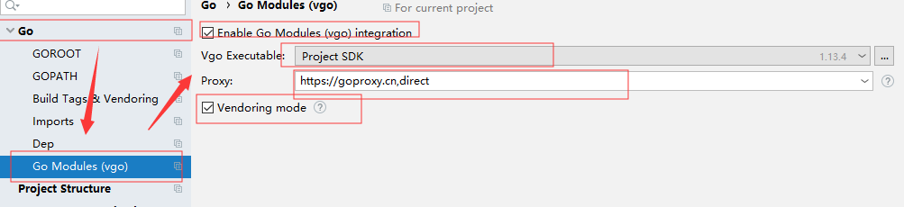

# Go语言入门(设置 go get 为国内源) #

---

## 前言 ##

Go语言学到 Gin 框架了, 其实每天学习是比较辛苦的事情, 坚持下去!

在使用 Go 过程中发现, 最无奈的是Go的一些模块下不下来, 即便挂了V, 油管2k不卡的那种, 依旧是 time out, 本文通过修改源为国内源的方法来规避此问题

## 正文 ##

推荐使用的两个, goproxy.cn 和 goproxy.io

连接分别是

    https://goproxy.cn
    https://goproxy.io
    
以下以cn举例,如想更换io步骤一样只是网址不一样

可直接跳转至 github 地址查看作者说明

    https://github.com/goproxy/goproxy.cn/blob/master/README.zh-CN.md
    
首先开启 Go 的MODULE支持

在DOS中输入

    SETX GO111MODULE on
    
Mac 为

    export GO111MODULE=on
    
然后替换软件源

软件源推荐某大佬与七牛合作的源, 七牛作为CDN分发大厂, 还是比较可靠的 

    https://github.com/goproxy/goproxy.cn
    
软件源为 

    https://goproxy.cn
    

win直接在环境变量添加(CMD可能会遇到权限等问题),系统变量和用户变量都添加!

Mac 为

    export GOPROXY=https://goproxy.cn,direct
    
即可

(后面加direct是cn镜像没有找到会按照默认找)

## GOLAND设置源 ##

GOLAND由于本身很完善所以会将项目的源覆盖,即使你已经在外面修改了源地址,当然,每次get前执行一遍设置国内源也是可以的,只是麻烦些

这里分享自带的setting修改(只对当前项目有用)



    作者： ChnMig
    
    出处：https://www.cnblogs.com/chnmig/p/11345600.html
    
    版权：本文采用「署名-非商业性使用-相同方式共享 4.0 国际」知识共享许可协议进行许可。
