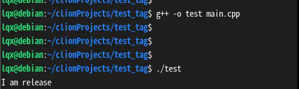

# go使用build tags实现条件编译

在C/C++中可以通过宏定义实现条件编译，比如在不同平台的机器上，调用不同的函数，或者通过编译是传递参数，调用不同的函数，比如下面的例子

#### C++条件编译

```c
#include <iostream>

#ifdef DEBUG

void fun1() {
    std::cout << "I am debug" << std::endl;
}

#else

void fun1() {
    std::cout << "I am release" << std::endl;
}

#endif

int main() {
    fun1();
    return 0;
}
```

现在就可以使用不同的编译参数，控制程序调用不同的函数

1. 不添加参数，直接编译

`g++ -o test main.cpp`

程序中没有定义 **DEBUG**这个宏，所以程序最终会调用 **I am release**这个函数  
执行程序验证一下  



和我们预期的一样

2. 在编译的时候添加参数，让程序调用debug函数  
   `g++ -DDEBUG -o test main.cpp`


也没有问题，程序最终调用的是 **I am debug** 这个函数

#### go条件编译

go虽然不支持宏定义，但是go可以通过 **build tags** 实现类似的功能。  
go的条件编译没有C++那么强大，可以在代码任意位置添加宏，实现条件编译，go的tags的作用范围是文件，也就是说go的编译器通过不同的tag去选择不同的文件。  
先创建`file.go` `file_debug.go` `main.go`这三个文件

**file.go**

```go
// +build !debug

package main

import "fmt"

func Fun1() {
    fmt.Println("I am release")
}
```

**file_debug.go**

```go
// +build debug

package main

import "fmt"

func Fun1() {
    fmt.Println("I am debug")
}
```

**main.go**

```go
package main

func main() {
    Fun1()
}
```

go的tags有几个注意的点

- `// +build debug` 必须在文件的最开始位置，一般在第一行
- `//` 和 `+`之间必须有一个空格
- `// +build debug` 下面必须有一个空行

只有满足这些条件后，这个tag才能正确的被编译器识别

1. 先正常编译  
   `go build -o release.exe`  
   执行程序，最终程序调用的是**I am release** 这个函数  
   


2. 在编译的时候，加参数使用debug版本的函数  
   `go build -tags debug -o debug.exe`  
   


##### go1.17改变

在go1.17之前，go的build tags 格式是 `// +build 条件`

从go1.17开始，开始支持 `//go:build 条件` 这种格式了

`//go:build 条件` 这种格式有什么好处呢，最明显的就是关系运算更符合编程语法了

在之前，想要表示 `windows 64位系统` 或者 是 `linux` 系统需要下面的语法

`// +build windows,amd64 linux`

原来的build tags `,` 是 `and` `空格` 是 `or` ，不符合常见编程语言的语法

从go1.17开始，同样的条件可以这样写了

`//go:build (windows && amd64) || linux`

这个表达式就比之前的明显多了

开始测试一下  
先创建`file.go` `file_x64.go` `main.go`三个文件

**file.go**

```go
//go:build windows && 386

package main

import "fmt"

func Fun1() {
    fmt.Println("I am windows 386")
}
```

**file_x64**

```go
//go:build windows && amd64

package main

import "fmt"

func Fun1() {
    fmt.Println("I am windows amd64")
}
```

**main.go**

```go
package main

func main() {
    Fun1()
}
```

编译 32位程序


编译64位程序


全都符合预期

#### 实际应用

说了这么多，tags在实际开发中有什么用处呢。  
最主要的就是功能就是可以通过编译参数控制使用那些代码编译得到程序。比如在不同的平台可以有不同的函数实现。不同的版本有不同的实现。

##### 举个栗子

一般log都会有不同的级别，必须开发中可以通过多打印一些数据，方便调试。但是程序上线后，为了性能考虑会关闭一些低级别的log，只保留 **error** 和 **waning** 级别的log。

虽然现在大多数log库都有log级别，但是如果不需要打印的log，但是还是调用了函数，其实还是会有一部分性能开销的，比如函数调用开销，参数传递开销等。为了进一步压榨性能，可以通过tags 在编译程序的时候，把低等级的log直接不编译到程序中。

回到第一个示例中，修改一下代码

**file.go**

```go
// +build !debug

package main

import "fmt"

func LogDebug(info string) {
    fmt.Println(info)
}
```

**file_debug.go**

```go
// +build debug

package main

func LogDebug(info string) {
}
```

**main.go**

```go
package main

func main() {
    LogDebug("aaaaaaaaaaaa")
}
```

可以看到，在非debug版本中，模拟正常打印log，在debug版本中，log函数只有一个空的函数，没有实现。  
先编译两个程序，然后通过反编译看看两次函数调用的区别

执行如下命令

```go
go build -tags debug -o debug.exe
go build -o release.exe
go tool objdump -s "main.main" ./debug.exe  > ./debug.s
go tool objdump -s "main.main" ./release.exe  > ./release.s
```

分别得到debug版本和release版本的汇编代码

**release.s**

```go
TEXT main.main(SB) D:/goProject/src/build_tag/main.go
  main.go:3     0x49e750        65488b0c2528000000  MOVQ GS:0x28, CX            
  main.go:3     0x49e759        488b8900000000      MOVQ 0(CX), CX              
  main.go:3     0x49e760        483b6110        CMPQ 0x10(CX), SP           
  main.go:3     0x49e764        0f8687000000        JBE 0x49e7f1                
  main.go:3     0x49e76a        4883ec58        SUBQ $0x58, SP              
  main.go:3     0x49e76e        48896c2450      MOVQ BP, 0x50(SP)           
  main.go:3     0x49e773        488d6c2450      LEAQ 0x50(SP), BP           
  main.go:4     0x49e778        488d0542fd0200      LEAQ go.string.*+5001(SB), AX       
  file.go:8     0x49e77f        48890424        MOVQ AX, 0(SP)              
  file.go:8     0x49e783        48c74424080c000000  MOVQ $0xc, 0x8(SP)          
  file.go:8     0x49e78c        e87fb1f6ff      CALL runtime.convTstring(SB)        
  file.go:8     0x49e791        488b442410      MOVQ 0x10(SP), AX           
  file.go:8     0x49e796        0f57c0          XORPS X0, X0                
  file.go:8     0x49e799        0f11442440      MOVUPS X0, 0x40(SP)         
  file.go:8     0x49e79e        488d0d3be70000      LEAQ runtime.types+57056(SB), CX    
  file.go:8     0x49e7a5        48894c2440      MOVQ CX, 0x40(SP)           
  file.go:8     0x49e7aa        4889442448      MOVQ AX, 0x48(SP)           
  print.go:274      0x49e7af        488b0592a50d00      MOVQ os.Stdout(SB), AX          
  print.go:274      0x49e7b6        488d0da3c40400      LEAQ go.itab.*os.File,io.Writer(SB), CX 
  print.go:274      0x49e7bd        48890c24        MOVQ CX, 0(SP)              
  print.go:274      0x49e7c1        4889442408      MOVQ AX, 0x8(SP)            
  print.go:274      0x49e7c6        488d442440      LEAQ 0x40(SP), AX           
  print.go:274      0x49e7cb        4889442410      MOVQ AX, 0x10(SP)           
  print.go:274      0x49e7d0        48c744241801000000  MOVQ $0x1, 0x18(SP)         
  print.go:274      0x49e7d9        48c744242001000000  MOVQ $0x1, 0x20(SP)         
  print.go:274      0x49e7e2        e8e998ffff      CALL fmt.Fprintln(SB)           
  file.go:8     0x49e7e7        488b6c2450      MOVQ 0x50(SP), BP           
  file.go:8     0x49e7ec        4883c458        ADDQ $0x58, SP              
  file.go:8     0x49e7f0        c3          RET                 
  main.go:3     0x49e7f1        e87acffbff      CALL runtime.morestack_noctxt(SB)   
  main.go:3     0x49e7f6        e955ffffff      JMP main.main(SB)           
```

可以看到在debug版本中，`LogDebug` 函数已经被编译器内联处理了。最终程序是调用了`fmt.Println`函数。

**release.s**

```bash
TEXT main.main(SB) D:/goProject/src/build_tag/main.go
  main.go:4     0x45b630        c3          RET         
  :0            0x45b631        cc          INT $0x3        
  :0            0x45b632        cc          INT $0x3        
  :0            0x45b633        cc          INT $0x3        
  :0            0x45b634        cc          INT $0x3        
  :0            0x45b635        cc          INT $0x3        
  :0            0x45b636        cc          INT $0x3        
  :0            0x45b637        cc          INT $0x3        
  :0            0x45b638        cc          INT $0x3        
  :0            0x45b639        cc          INT $0x3        
  :0            0x45b63a        cc          INT $0x3        
  :0            0x45b63b        cc          INT $0x3        
  :0            0x45b63c        cc          INT $0x3        
  :0            0x45b63d        cc          INT $0x3        
  :0            0x45b63e        cc          INT $0x3        
  :0            0x45b63f        cc          INT $0x3        
```

相比之下，release版本的汇编代码就简单多了，因为编译器会进行内联处理，但是发现`LogDebug`这个函数是一个空函数，所以就直接跳过编译了。

#### 总结

1. go也可以实现条件编译，但是不能像C++那样灵活，只能以文件为单位
2. 在go1.17之前使用`// +build 条件`，从1.17开始可以使用`//go:build 条件`
3. go预设了很多tags，也可以自定义tags
4. 在编译时，使用 -tags 个自定义的tags赋值

作者：QxQx  
链接：https://www.jianshu.com/p/abb56273a862  
来源：简书  
著作权归作者所有。商业转载请联系作者获得授权，非商业转载请注明出处。