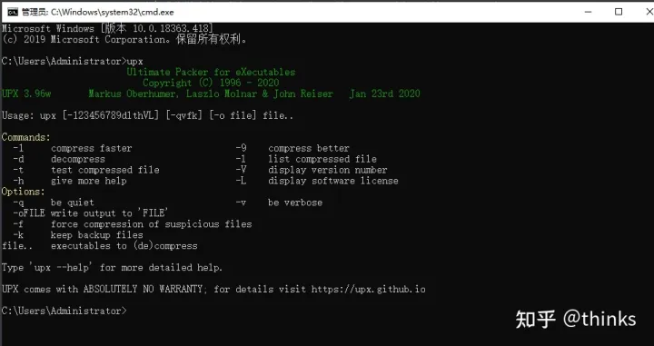

# go语言编译优化

go语言能够快速编译成二进制可执行文件，能够加速程序的发布和安装流程。下面我们将编译选项和第三方压缩工具两方面来介绍如何有效地减小 Go 语言编译后的体积。

下面我们写一个简单的测试工程来测试不同方式的效果

下面的程序启动一个RPC服务，

```go
package main

import (
    "log"
    "net/http"
    "net/rpc"
)
// 编译优化

type Result struct {
    Num, Ans int
}

type Calc int

func (calc *Calc) Square(num int, result *Result) error {
    result.Num = num
    result.Ans = num * num
    return nil
}

func main() {
    err := rpc.Register(new(Calc))
    if err != nil {
        log.Print(err)
    }
    rpc.HandleHTTP()
    log.Printf("Serving RPC server on port %d", 1234)
    if err := http.ListenAndServe(":1234", nil); err != nil {
        log.Fatal("Error server, err")
    }
}
```

### 1、使用默认的编译选择:

```text
go build -o main.exe main.go
```

编译后大小：10,040,320字节，换算后为`9.57M`

### 2、编译选项

Go 编译器默认编译出来的程序会带有符号表和调试信息，一般来说 release 版本可以去除调试信息以减小二进制体积。

执行以下命令：

> -s: 忽略符号表和调试信息
> -w: 忽略DWARFv3调试信息，使用该选项后将无法使用gdb进行调试

```text
go build -ldflags="-s -w" -o main.exe main.go
```

编译可执行文件的提交为：`7.08M`,相比于直接编译体积下降了 `27%`

3、使用`upx`减少体积

### 3.1 安装upx

下载地址： [https://github.com/upx/upx/releases/](https://link.zhihu.com/?target=https%3A//github.com/upx/upx/releases/)

[upx](https://link.zhihu.com/?target=https%3A//github.com/upx/upx) 是一个常用的压缩动态库和可执行文件的工具，通常可减少 50-70% 的体积。

upx 的安装方式非常简单，我们可以直接下载最新的 release 版本，支持 Windows 和 Linux。



### 3.2 仅使用upx编译

upx 有很多参数，最重要的则是压缩率，`1-9`，`1` 代表最低压缩率，`9` 代表最高压缩率。

接下来我们使用upx压缩，编译软件。

```powershell
go build -o main.exe main.go && upx -9 main.exe
```

编译过程如下：

```text
D:\go_workspace\src\learngo\CompilerOptimization> go build -o main.exe main.go && upx -9 main.exe
                       Ultimate Packer for eXecutables
                          Copyright (C) 1996 - 2020
UPX 3.96w       Markus Oberhumer, Laszlo Molnar & John Reiser   Jan 23rd 2020

        File size         Ratio      Format      Name
   --------------------   ------   -----------   -----------
  10040320 ->   4958208   49.38%    win64/pe     main.exe                                                                                                                Packed 1 file.
```

没有添加编译选项，经过upx压缩后体积为 `4.72M`，体积降低了`50.6%`

### 3.3 upx和编译选项组合

接下来使用使用upx命令，并结合编译选项来编译程序：

```text
go build -ldflags="-s -v" -o main.exe main.go && upx -9 main.exe
```

编译过程：

```text
D:\go_workspace\src\learngo\CompilerOptimization>go build -ldflags="-s -v" -o main.exe main.go && upx -9 main.exe
# command-line-arguments
HEADER = -H10 -T0xffffffffffffffff -R0xffffffff
deadcode
pclntab=2218637 bytes, funcdata total 571934 bytes
130387 symbols
384800 liveness data
                       Ultimate Packer for eXecutables
                          Copyright (C) 1996 - 2020
UPX 3.96w       Markus Oberhumer, Laszlo Molnar & John Reiser   Jan 23rd 2020

        File size         Ratio      Format      Name
   --------------------   ------   -----------   -----------
   7425536 ->   2557440   34.44%    win64/pe     main.exe                                                                                                                Packed 1 file.
```

使用编译选项后，体积从原来的 9.57M 下降了 20% 到 7.08M，使用 upx 压缩后，体积进一步下降 60% 到 `2.43M`。累进下降约 68%，非常不可思议。

### 3.4 upx 的原理

upx 压缩后的程序和压缩前的程序一样，无需解压仍然能够正常地运行，这种压缩方法称之为带壳压缩，压缩包含两个部分：

- 在程序开头或其他合适的地方插入解压代码；
- 将程序的其他部分压缩。

执行时，也包含两个部分：

- 首先执行的是程序开头的插入的解压代码，将原来的程序在内存中解压出来；
- 再执行解压后的程序。

也就是说，upx 在程序执行时，会有额外的解压动作，不过这个耗时几乎可以忽略。

如果对编译后的体积没什么要求的情况下，可以不使用 upx 来压缩。一般在服务器端独立运行的后台服务，无需压缩体积。

经过测试，如果是用upx压缩，因为可行性文件执行时提前执行一个解压缩过程，所有执行速度会稍微慢一点。

## 附 推荐与参考

- [https://stackoverflow.com/questions/3861634/how-to-reduce-compiled-file-size](https://link.zhihu.com/?target=https%3A//stackoverflow.com/questions/3861634/how-to-reduce-compiled-file-size)
- [https://geektutu.com/post/hpg-r](https://link.zhihu.com/?target=https%3A//geektutu.com/post/hpg-reduce-size.html)