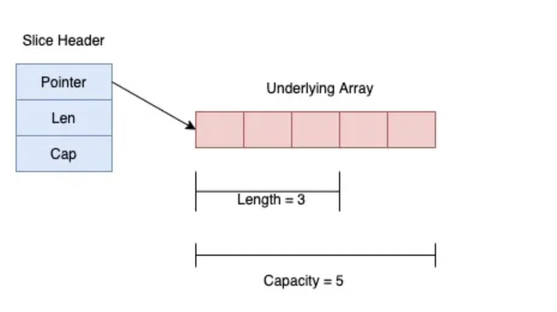

# 大厂 Go 编程规范（三）：Slices 和 Maps #

slice 和map 的原理类型。我们先看slice定义

```
type SliceHeader struct {
        Pointer uintptr
        Len  int
        Cap  int
}
```

包含了一个指向数据的指针以及slice的长度（len）和容量（capacity）。



所以我们将slice 当做参数传递的时候，底层共享的是同一份数据。

比如下面的代码，我们先定义一个SetTrips方法，传入一个 slice 给driver。

```
func (d *Driver) SetTrips(trips []Trip) {
  d.trips = trips
}

trips := ... 
d1.SetTrips(trips)

// 你是要修改 d1.trips 吗？
trips[0] = ...
```

然后我们在外部修改trips，那么 driver 里面 trips 也会跟着发生变化，这是我们不希望看到的。

所以更加安全的方式是，在方法里面创建一个新的slice，然后逐一拷贝原生数据，这样外部的数据变化就不会影响到driver了。如下：

```
func (d *Driver) SetTrips(trips []Trip) {
  d.trips = make([]Trip, len(trips))
  copy(d.trips, trips)
}

trips := ...
d1.SetTrips(trips)

// 这里我们修改 trips[0]，但不会影响到 d1.trips
trips[0] = ..
```

回看上一篇通过mutex 创建线程安全map 的文章，如果想返回整个 map 的内容，可以通过下面的方式。

```
func (s *Stats) Snapshot() map[string]int {
  s.mu.Lock()
  defer s.mu.Unlock()

  return s.counters
}
```

但这样直接返回map 的方式，会导致调用者获取了一个非安全的map的。如果在调用的地方修改这个map，就会发生数据冲突。更加安全的做法是

```
func (s *Stats) Snapshot() map[string]int {
  s.mu.Lock()
  defer s.mu.Unlock()

  result := make(map[string]int, len(s.counters))
  for k, v := range s.counters {
    result[k] = v
  }
  return result
}
```

创建一个新的map 返回，这样只是返回这个map 此时的快照，后续对 result的修改，并不会影响 stats 中map 的内容。

