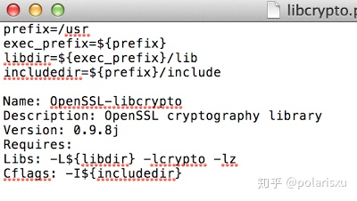
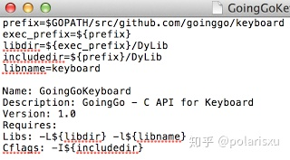

# cgo引用定义不一致_将 CGO 与 Pkg-Config 和 自定义动态库位置一起使用 #

我在这个月初写过一篇关于 Go 程序使用 C 动态库的文章。那篇文章构建了一个 C 语言动态库，并编写了一个使用该动态库的 Go 程序。但其中的 Go 代码只有动态库和程序在同一个文件夹下才能正确工作。

这个限制导致无法使用 go get 命令直接下载，编译，并安装这个程序的工作版本。我不想代码需要预先安装依赖或者在调用 go-get 之后执行任何脚本和命令才能正确运行。Go 的工具套件不会把 C 语言的动态库拷贝到 bin 目录下，因为我无法在 go-get 命令完成后，就运行程序。这简直是不可接受的，必须有办法让我能够在运行完 Go-get 之后，就获得一个正确运行程序。

解决这个问题，需要两个步骤。第一步，我需要使用包配置文件 (package configuration file) 来指定 CGO 的编译器和链接器。第二步，我需要为操作系统设置一个环境变量，让它能在不需要将二进制文件拷贝到 bin 目录下，找到二进制文件。

如果你找找看，你会发现有些标准库同样也有一个包配置 (.pc) 文件。一个名为 pkg-config 的特殊程序被构建工具（如 gcc）用于从这些文件中检索信息。


如果我们查看头文件的标准文件，例如 /usr/lib 或 /usr/local/lib，你会发现一个名为 pkgconfig 的文件夹。默认情况下，pkg-config 程序可以找到这些位置中存在的包配置文件。

查看libcrypto.pc文件，您可以看到格式以及它如何提供编译器和链接器信息。



这个特定的文件看起来非常整洁清晰，因为他在最简格式的前提下包含了所需要的参数。

如果想了解更多关于这些文件的信息，请阅读网页：https://www.freedesktop.org/wiki/Software/pkg-config/

文件头部的 prefix 的变量是最重要的。这个变量指定库和头文件被安装的基础目录 (base folder)。

另外一个需要注意的事情是，你不能使用环境变量来帮助指定一条路径位置。如果你这么做，构建工具在定位它所需要的任何文件都会有类似的问题 (you will have problems with the build tools locating any of the files it needs.)。 这个环境变量最终会一个字符串的形式提供给编译工具。请记住这一点，因为它很重要。

以下参数在终端运行这个 pkg-config 命令：

	pkg-config – cflags – libs libcrypto

这些参数要求 pkg-config 程序显示 libcrypto 这个 .pc 类型文件所设定的编译器和链接器参数。

这是应该返回的：

	-lcrypto -lz

让我们看一下，为了我所工作的一个项目而下载和安装在 /usr/local 目录下的 ImageMagick 的一个包配置文件：


这个文件有些稍微复杂。你会注意到它指定了它所需要的 MagickCode 库以及一些作为环境变量的参数。

当我对这个文件运行 pkg-config 程序时，我得到以下反馈信息：

```
pkg-config – cflags – libs MagickWand
 
-fopenmp -DMAGICKCORE_HDRI_ENABLE=0 -DMAGICKCORE_QUANTUM_DEPTH=16
-I/usr/local/include/ImageMagick-6  -L/usr/local/lib -lMagickWand-6.Q16
-lMagickCore-6.Q16
```

你能看到头文件和库文件路径是绝对路径。在包配置文件中定义的其他参数都出现在命令的返回结果中。

现在，我们对包配置文件有了些了解，并且知道如何使用 pkg-config 工具。让我们看看我为了Go 语言中使用 C 动态库 这篇文章对这个项目的修改。 这个项目现在使用一个包配置文件和新的 cgo 参数。

在我们开始之前，我必须先抱歉，因为针对这个项目所构建的动态库只能够在 Mac 上编译。上面我所提到文章说明了原因。动态库的预编译版本已经存在在版本控制系统中，如果你不在 Mac 上工作，那么这个项目就无法正常地编译，但是项目的思路，设置和结构都是正确的。

打开一个终端窗口，然后运行以下命令 :

```
cd $HOME
export GOPATH=$HOME/keyboard
export PKG_CONFIG_PATH=$GOPATH/src/github.com/goinggo/keyboard/pkgconfig
export DYLD_LIBRARY_PATH=$GOPATH/src/github.com/goinggo/keyboard/DyLib
go get Github.com/goinggo/keyboard
```

在运行完这些命令后，你将会从 GoingGo/keyboard 仓库下载所有的代码到你 Home 目录下一个名字为 keyboard 的子目录。


你会注意到 Go 工具套件能够下载，编译，安装 keyboard 程序。尽管头文件和动态链接库没有在默认目录 /usr 和 /usr/local 下。

在 /bin 目录下，我们有一个单独的可执行程序，但动态链接库不在这个目录下，链接库只存放在 DyLib 目录下。

在项目中有一个名字为 pkgconfig 的新的文件夹。在该文件下的包配置文件让这一切称为可能。

为了利用这个包配置文件，对 main.go 的源码做了修改。

如果我们切换到 bin 目录下，并且执行程序，我们能看到它能正常工作。

```
cd $GOPATH/bin
./keyboard
```

当我们开始程序时，它会马上要求我们输入些字符。输入些字符并且输入 q 字母来退出这个程序。

只有当操作系统查找到这个程序所依赖的动态链接库的时候，程序运行才是可能的。

让我们看一下什么样的代码修改让程序能够运行。查看 main.go 的源代码，看看我们是如何引用新的包配置文件的。

这是第一个博文的源代码。在这个版本中，我直接指定了编译器和链接器的参数。头文件和动态链接库的位置是通过相对路径找到的。

```
package main
 
/*
#cgo CFLAGS: -I../DyLib
#cgo LDFLAGS: -L. -lkeyboard
#include <keyboard.h>
*/
import "C"
```

这是修改后的代码。在这个代码中，我告诉 CGO 使用 pkg-config 程序来寻找编译和链接的参数。包配置文件的名字在结尾处被指定。

```
package main
 
/*
#cgo pkg-config: – define-variable=prefix=. GoingGoKeyboard
#include <keyboard.h>
*/
import "C"
```

注意一下，pkg-config 程序使用 -define-variable 参数。这个设置是让一切运转的诀窍。让我们马上回过头来看看。

对我们的包配置文件，运行 pkg-config 程序：

```
pkg-config – cflags – libs GoingGoKeyboard
 
-I$GOPATH/src/github.com/goinggo/keyboard/DyLib
-L$GOPATH/src/github.com/goinggo/keyboard/DyLib -lkeyboard
```

如果仔细观察调用的输出，你会看到些我告诉你的错误的用法。$GOPATH 环境变量是运行时提供的。

打开在 pkgconfig 目录下的包配置文件，你会看到 pkg-config 程序没有撒谎。在文件的头部，我正在使用 $GOPATH 设置一条路径的前缀路径 (prefix variable)。 那为什么一切都有效？



让我们使用在 main.go 代码中相同的选项运行这个程序：

```
pkg-config – cflags – libs GoingGoKeyboard – define-variable=prefix=.
 
-I./DyLib
-L./DyLib -lkeyboard
```

你看到有什么不同吗？在第一次运行 pkg-config 程序时，我们获得的路径中使用 $GOPAHT 这样一个字符串的，因为这就是前缀变量的设置方式。第二次运行时，我们将前缀变量的值覆盖到当前目录， 得到我们想要的返回。

还记得我们在使用 Go 工具之前设置的环境变量吗？

	PKG_CONFIG_PATH=$GOPATH/src/github.com/goinggo/keyboard/pkgconfig

PKG_CONFIG_PATH 环境变量告诉 pkg-config 程序，它可以在哪里找到不在任何默认位置的软件包配置文件。我们的 GoingGoKeyboard.pc 文件就是这样被 pkg-config 程序找到的。

最后一个要解释的谜团是，操作系统如何找到运行我们程序所需要的动态库。还记得我们在使用 Go 工具之前设置的这个环境变量吗？

	export DYLD_LIBRARY_PATH=$GOPATH/src/github.com/goinggo/keyboard/DyLib

DYLD_LIBRARY_PATH 环境变量告诉操作系统在哪里还可以查找动态库。

在 /usr/local 文件夹中安装动态库可以使事情保持简单。默认情况下，所有构建工具都配置为在这个文件夹中查找。但是，如果对自己的或第三方库文件使用默认位置，需要在运行 Go 工具之前执行额外的安装步骤。通过使用包配置文件，向 pkg-config 程序传递所需的选项，使用 CGO 的 Go 程序可以部署安装即可运行的构建。

还有一个我们提到的好处，你可以使用这种技术来将第三方库安装到一个临时的路径下进行测试使用。这让你在不想使用这个第三库时，可以很方便地进行移除。

如果您想在 Windows 或 Ubuntu 的机器上尝试这些代码或概念，请阅读Go 语言中使用 C 动态库 ，了解如何构建您自己的动态库以供自己进行实验。

相关资源：[混沌游戏优化(CGO):混沌游戏优化(CGO)算法是一种简单但高效的优化..](https://download.csdn.net/download/weixin_38552536/19271380?spm=1001.2101.3001.5697).

————————————————

版权声明：本文为CSDN博主「飞地APP」的原创文章，遵循CC 4.0 BY-SA版权协议，转载请附上原文出处链接及本声明。

原文链接：https://blog.csdn.net/weixin_42293387/article/details/112119705