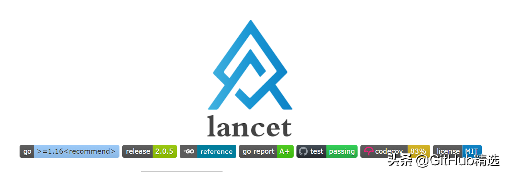

# 支持300+常用功能的开源GO语言工具函数库

《开源精选》是我们分享Github、Gitee等开源社区中优质项目的栏目，包括技术、学习、实用与各种有趣的内容。本期推荐的是一个Go语言工具函数库——Lancet。



lancet（柳叶刀）是一个全面、高效、可复用的go语言工具函数库。 lancet受到了java apache common包和lodash.js的启发。

# 特性

- 全面、高效、可复用
- 300+常用go工具函数，支持string、slice、datetime、net、crypt...
- 只依赖go标准库
- 所有导出函数单元测试覆盖率100%

# 安装

1、对于使用go1.18及以上的用户，建议安装v2.x.x。因为v2.x.x用go1.18的泛型重写了大部分函数。

```
go get github.com/duke-git/lancet/v2 //安装v2最新版本v2.x.x
```

2、使用go1.18以下版本的用户，必须安装v1.x.x。目前最新的v1版本是v1.2.9。

```
go get github.com/duke-git/lancet@v1.2.9 // 使用go1.18以下版本, 必须安装v1.x.x版本
```

# 用法

lancet是以包的结构组织代码的，使用时需要导入相应的包名。例如：如果使用字符串相关函数，需要导入strutil包：

```
import "github.com/duke-git/lancet/v2/strutil"
```

此处以字符串工具函数ReverseStr（逆序字符串）为例，需要导入strutil包：

```
package main

import (
    "fmt"
    "github.com/duke-git/lancet/v2/strutil"
)

func main() {
    s := "hello"
    rs := strutil.ReverseStr(s)
    fmt.Println(rs) //olleh
}
```

# 算法包

algorithm算法包实现一些基本算法。例如：sort、search、lrucache等。

```
import ( "github.com/duke-git/lancet/v2/algorithm")
```

**示例：BubbleSort**

冒泡排序，参数comparator需要实现包  
lancetconstraints.Comparator

**函数签名：**

```
func BubbleSort[T any](slice []T, comparator lancetconstraints.Comparator)
```

**Example：**

```
package main

import (
    "fmt"
    "github.com/duke-git/lancet/v2/algorithm"
)

func main() {
    type intComparator struct{}

    func (c *intComparator) Compare(v1 any, v2 any) int {
        val1, _ := v1.(int)
        val2, _ := v2.(int)

        //ascending order
        if val1 < val2 {
            return -1
        } else if val1 > val2 {
            return 1
        }
        return 0
    }

    intSlice := []int{2, 1, 5, 3, 6, 4}
    comparator := &intComparator{}
    algorithm.BubbleSort(intSlice, comparator)

    fmt.Println(intSlice) //[]int{1, 2, 3, 4, 5, 6}
}
```

# 并发包

并发包包含一些支持并发编程的功能。例如：goroutine、channel、async等。

```
import "github.com/duke-git/lancet/v2/concurrency"
```

**示例：NewChannel**

返回一个 Channel 指针实例

**函数签名：**

```
type Channel struct {}
func NewChannel() *Channel
```

**Example：**

```
package main

import (
    "fmt"
    "github.com/duke-git/lancet/v2/concurrency"
)

func main() {
    c := concurrency.NewChannel()
}
```

# 转换器包

convertor转换器包支持一些常见的数据类型转换。

```
import "github.com/duke-git/lancet/v2/convertor"
```

**示例：ToBool**

字符串转布尔类型，使用strconv.ParseBool

**函数签名：**

```
func ToBool(s string) (bool, error)
```

**Example：**

```
package main

import (
    "fmt"
    "github.com/duke-git/lancet/v2/convertor"
)

func main() {
    v1, _ := convertor.ToBool("1")
    fmt.Println(v1) //true

    v2, _ := convertor.ToBool("true")
    fmt.Println(v2) //true

    v3, _ := convertor.ToBool("True")
    fmt.Println(v3) //true

    v4, _ := convertor.ToBool("123")
    fmt.Println(v4) //false
}
```

# 加密包

cryptor加密包支持数据加密和解密，获取md5，hash值。支持base64、md5、hmac、aes、des、rsa。

```
import "github.com/duke-git/lancet/v2/cryptor"
```

**示例：AesEcbEncrypt**

使用AES ECB算法模式加密数据. 参数`key`的长度是16, 24 or 32。

**函数签名：**

```
func AesEcbEncrypt(data, key []byte) []byte
```

**Example：**

```
package main

import (
    "fmt"
    "github.com/duke-git/lancet/v2/cryptor"
)

func main() {
    data := "hello world"
      key := "abcdefghijklmnop"
    encrypted := cryptor.AesEcbEncrypt([]byte(data), []byte(key))

    fmt.Println(string(encrypted))
}
```

—END—

开源协议：MIT

开源地址：  
https://github.com/duke-git/lancet
