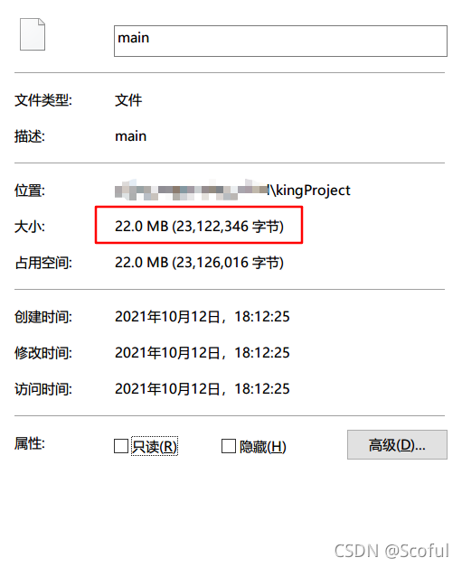
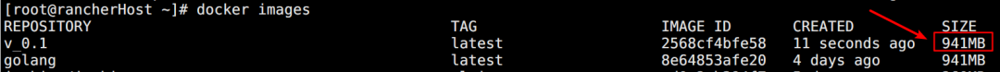
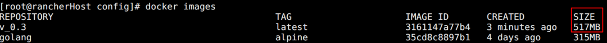
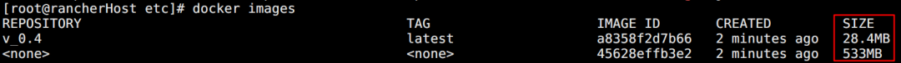
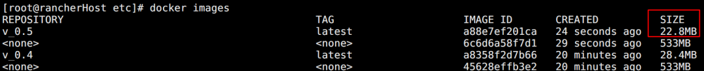
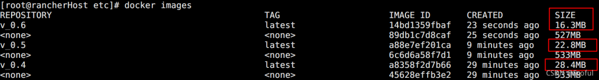

# 给go项目打最小docker镜像，足足降低99%

【导读】go 项目怎么让 docker 镜像体积减小？本文做了详细介绍。

# 1. 直接编译得到运行文件 22M

使用的项目源码地址 (https://github.com/scoful/kingProject)  
本地直接编译打一个linux运行包

```
set GOOS=linux 
set GOARCH=amd64 
go build main.go
```

  

**结果是22M**

# 2. 不编译直接运行的镜像 941M

Dockerfile文件内容

```
# 基础镜像，基于golang最新镜像构建
FROM golang
# 作者
MAINTAINER scoful
# 全局工作目录
WORKDIR $GOPATH/kingProject
# 把运行Dockerfile文件的当前目录所有文件复制到目标目录
COPY . $GOPATH/kingProject
# 环境变量
#  用于代理下载go项目依赖的包
ENV GOPROXY https://goproxy.cn,direct
# 需暴露的端口
EXPOSE 8888
# 可外挂的目录
VOLUME ["/go/kingProject/config","/go/kingProject/log"]
# docker run命令触发的真实命令(相当于不编译打包，源代码直接运行)
ENTRYPOINT ["go","run","main.go"]
```

编译镜像后查询结果如下：  

  

**结果是941M，基本跟基础镜像golang的大小一致，而且因为没有预先编译，等到运行的时候再编译并拉取依赖包，run起来很慢**

# 3. 编译后的镜像 1.14G

Dockerfile文件内容

```
# 基础镜像，基于golang最新镜像构建
FROM golang
# 作者
MAINTAINER scoful
# 全局工作目录
WORKDIR $GOPATH/kingProject
# 把运行Dockerfile文件的当前目录所有文件复制到目标目录
COPY . $GOPATH/kingProject
# 环境变量
#  用于代理下载go项目依赖的包
ENV GOPROXY https://goproxy.cn,direct
# 编译
RUN GOOS=linux GOARCH=amd64 go build main.go
# 需暴露的端口
EXPOSE 8888
# 可外挂的目录
VOLUME ["/go/kingProject/config","/go/kingProject/log"]
# docker run命令触发的真实命令(相当于直接运行编译后的可运行文件)
ENTRYPOINT ["./main"]
```

  

**结果是1.14G，更大了，因为加上了编译过程中拉取的包，但是预先编译，所以直接run，速度很快**

# 4. 优化：使用alpine版本的基础镜像 517M

**优化的方向**：如果一个镜像在https://hub.docker.com/里能搜到有alpine版本，尽量用alpine版本，相当于是官方提供的最小化可用版本

Dockerfile文件内容

```
# 基础镜像，基于golang的alpine版本镜像构建
FROM golang:alpine
# 作者
MAINTAINER scoful
# 全局工作目录
WORKDIR $GOPATH/kingProject
# 把运行Dockerfile文件的当前目录所有文件复制到目标目录
COPY . $GOPATH/kingProject
# 环境变量
#  用于代理下载go项目依赖的包
ENV GOPROXY https://goproxy.cn,direct
# 编译
RUN GOOS=linux GOARCH=amd64 go build main.go
# 需暴露的端口
EXPOSE 8888
# 可外挂的目录
VOLUME ["/go/kingProject/config","/go/kingProject/log"]
# docker run命令触发的真实命令(相当于直接运行编译后的可运行文件)
ENTRYPOINT ["./main"]
```

  

**结果是517M，比1.14G减少了650.36M，直接降了56%，而且run一样很快**

# 5. 再优化：使用多级构建的镜像 28.4M

**再优化的方向**：go项目其实只是在build的阶段需要go环境，run的时候是不需要的，那build完后go环境用个alpine版本就行

Dockerfile文件内容

```
# 基础镜像，基于golang的alpine镜像构建--编译阶段
FROM golang:alpine AS builder
# 作者
MAINTAINER scoful
# 全局工作目录
WORKDIR /go/kingProject
# 把运行Dockerfile文件的当前目录所有文件复制到目标目录
COPY . /go/kingProject
# 环境变量
#  用于代理下载go项目依赖的包
ENV GOPROXY https://goproxy.cn,direct
# 编译，关闭CGO，防止编译后的文件有动态链接，而alpine镜像里有些c库没有，直接没有文件的错误
RUN GOOS=linux GOARCH=amd64 CGO_ENABLED=0 go build main.go

# 使用alpine这个轻量级镜像为基础镜像--运行阶段
FROM alpine AS runner
# 全局工作目录
WORKDIR /go/kingProject
# 复制编译阶段编译出来的运行文件到目标目录
COPY --from=builder /go/kingProject/main .
# 复制编译阶段里的config文件夹到目标目录
COPY --from=builder /go/kingProject/config ./config
# 需暴露的端口
EXPOSE 8888
# 可外挂的目录
VOLUME ["/go/kingProject/config","/go/kingProject/log"]
# docker run命令触发的真实命令(相当于直接运行编译后的可运行文件)
ENTRYPOINT ["./main"]
```

  

**结果是28.4M，比517M减少了488.6M，再降95%，那个533M是第一级构建生成的**

# 6. 再再优化：使用多级构建+scratch基础镜像 22.8M

**再再优化的方向**：再极端一点，第二级构建的时候用个空镜像来当基础镜像

Dockerfile文件内容

```
# 基础镜像，基于golang的alpine镜像构建--编译阶段
FROM golang:alpine AS builder
# 作者
MAINTAINER scoful
# 全局工作目录
WORKDIR /go/kingProject
# 把运行Dockerfile文件的当前目录所有文件复制到目标目录
COPY . /go/kingProject
# 环境变量
#  用于代理下载go项目依赖的包
ENV GOPROXY https://goproxy.cn,direct
# 编译，关闭CGO，防止编译后的文件有动态链接，而alpine镜像里有些c库没有，直接没有文件的错误
RUN GOOS=linux GOARCH=amd64 CGO_ENABLED=0 go build main.go


# 使用scratch这个空镜像为基础镜像--运行阶段
FROM scratch AS runner
# 全局工作目录
WORKDIR /go/kingProject
# 复制编译阶段编译出来的运行文件到目标目录
COPY --from=builder /go/kingProject/main .
# 复制编译阶段里的config文件夹到目标目录
COPY --from=builder /go/kingProject/config ./config
# 需暴露的端口
EXPOSE 8888
# 可外挂的目录
VOLUME ["/go/kingProject/config","/go/kingProject/log"]
# docker run命令触发的真实命令(相当于直接运行编译后的可运行文件)
ENTRYPOINT ["./main"]
```

  

**结果是22.8M，已经约等于不用镜像直接编译出的可执行文件大小了，比28.4M减少了5.6M，再降20%，但用scratch当基础镜像的坏处是没法exec进入容器内部，因为真的就是空镜像，啥都没有，啥都不支持**

# 7. 再再再优化：go编译命令去掉冗余输出 16.3M

**再再再优化的方向**：再再极端一点，go编译的时候，加上参数 `-ldflags="-w \-s"`，直接去掉一些冗余输出内容

Dockerfile文件内容

```
# 基础镜像，基于golang的alpine镜像构建--编译阶段
FROM golang:alpine AS builder
# 作者
MAINTAINER scoful
# 全局工作目录
WORKDIR /go/kingProject
# 把运行Dockerfile文件的当前目录所有文件复制到目标目录
COPY . /go/kingProject
# 环境变量
#  用于代理下载go项目依赖的包
ENV GOPROXY https://goproxy.cn,direct
# 编译，关闭CGO，防止编译后的文件有动态链接，而alpine镜像里有些c库没有，直接没有文件的错误
RUN GOOS=linux GOARCH=amd64 CGO_ENABLED=0 go build -ldflags="-w -s" main.go


# 使用scratch这个空镜像为基础镜像--运行阶段
FROM scratch AS runner
# 全局工作目录
WORKDIR /go/kingProject
# 复制编译阶段编译出来的运行文件到目标目录
COPY --from=builder /go/kingProject/main .
# 复制编译阶段里的config文件夹到目标目录
COPY --from=builder /go/kingProject/config ./config
# 需暴露的端口
EXPOSE 8888
# 可外挂的目录
VOLUME ["/go/kingProject/config","/go/kingProject/log"]
# docker run命令触发的真实命令(相当于直接运行编译后的可运行文件)
ENTRYPOINT ["./main"]
```

  

**结果是16.3M，看似比不用镜像直接编译出的可执行文件还小，那是因为直接编译没有加上这个参数，如果加上大小还是差不多的，比22.8M减少了6.5M，再降29%，好了，降无可降了，用1.14G来对比的话，减少了1.12G，足足降了99%，鹅妹子嘤！**

# 8. 最终版：顺便解决时区问题 16.3M

Dockerfile文件内容

```
# 基础镜像，基于golang的alpine镜像构建--编译阶段
FROM golang:alpine AS builder
# 作者
MAINTAINER scoful
# 全局工作目录
WORKDIR /go/kingProject
# 把运行Dockerfile文件的当前目录所有文件复制到目标目录
COPY . /go/kingProject
# 环境变量
#  用于代理下载go项目依赖的包
ENV GOPROXY https://goproxy.cn,direct
# 编译，关闭CGO，防止编译后的文件有动态链接，而alpine镜像里有些c库没有，直接没有文件的错误
RUN GOOS=linux GOARCH=amd64 CGO_ENABLED=0 go build -ldflags="-w -s" main.go
RUN echo "https://mirrors.aliyun.com/alpine/v3.8/main/" > /etc/apk/repositories \
    && echo "https://mirrors.aliyun.com/alpine/v3.8/community/" >> /etc/apk/repositories \
    && apk add --no-cache tzdata \
    && cp /usr/share/zoneinfo/Asia/Shanghai /etc/localtime  \
    && echo Asia/Shanghai > /etc/timezone \
    && apk del tzdata

# 使用scratch这个空镜像为基础镜像--运行阶段
FROM scratch AS runner
# 全局工作目录
WORKDIR /go/kingProject
# 复制编译阶段编译出来的运行文件到目标目录
COPY --from=builder /go/kingProject/main .
# 复制编译阶段里的config文件夹到目标目录
COPY --from=builder /go/kingProject/config ./config
# 复制编译阶段里的时区文件到目标目录
COPY --from=builder /etc/localtime /etc/localtime
COPY --from=builder /etc/timezone /etc/timezone
# 需暴露的端口
EXPOSE 8888
# 可外挂的目录
VOLUME ["/go/kingProject/config","/go/kingProject/log"]
# docker run命令触发的真实命令(相当于直接运行编译后的可运行文件)
ENTRYPOINT ["./main"]
```

# 9. 最最推荐使用版：多级+alpine 21.9M

综上所述，scratch镜像有它的缺陷，是一个真的空镜像，不支持很多命令，比如cp，sh等，如果要进入容器内部查东西，都进不去，不适合真实情况，所以还是推荐alpine镜像，很小5M多，可以接受。

Dockerfile文件内容

```
# 基础镜像，基于golang的alpine镜像构建--编译阶段
FROM golang:alpine AS builder
# 作者
MAINTAINER scoful
# 全局工作目录
WORKDIR /go/kingProject
# 把运行Dockerfile文件的当前目录所有文件复制到目标目录
COPY . /go/kingProject
# 环境变量
#  用于代理下载go项目依赖的包
ENV GOPROXY https://goproxy.cn,direct
# 编译，关闭CGO，防止编译后的文件有动态链接，而alpine镜像里有些c库没有，直接没有文件的错误
RUN GOOS=linux GOARCH=amd64 CGO_ENABLED=0 go build -ldflags="-w -s" main.go


# 使用alpine这个轻量级镜像为基础镜像--运行阶段
FROM alpine AS runner
# 全局工作目录
WORKDIR /go/kingProject
# 复制编译阶段编译出来的运行文件到目标目录
COPY --from=builder /go/kingProject/main .
# 复制编译阶段里的config文件夹到目标目录
COPY --from=builder /go/kingProject/config ./config
# 将时区设置为东八区
RUN echo "https://mirrors.aliyun.com/alpine/v3.8/main/" > /etc/apk/repositories \
    && echo "https://mirrors.aliyun.com/alpine/v3.8/community/" >> /etc/apk/repositories \
    && apk add --no-cache tzdata \
    && cp /usr/share/zoneinfo/Asia/Shanghai /etc/localtime  \
    && echo Asia/Shanghai > /etc/timezone \
    && apk del tzdata
# 需暴露的端口
EXPOSE 8888
# 可外挂的目录
VOLUME ["/go/kingProject/config","/go/kingProject/log"]
# docker run命令触发的真实命令(相当于直接运行编译后的可运行文件)
ENTRYPOINT ["./main"]
```

over，Enjoy！！！

> 转自：
> 
> blog.csdn.net/Scoful/article/details/120729102

- EOF -
